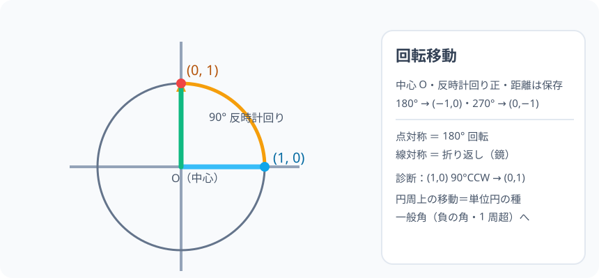

# 回転移動・対称移動：形そのままで、向きだけ動かす

> [!abstract] このノードの核心
> 図形を「動かせど変えない」3 種類の移動がある——平行移動・**回転移動**（中心の周りを回す）・**対称移動**（折り返し）。いずれも大きさ・形は保たれる（合同）。回転は反時計回りを正とし、座標上の点 (1,0) を原点中心に 90° 回すと (0,1) に来る——この「サークル周りの回転の見る目」が後の単位円（三角比）につながる。

> [!success] 合格ライン
> 回転移動と対称移動の定義と違いを言え、点 (1,0) を 90°・180°・270° 回した位置を座標で答えられる（＝診断の答え (0,1)）。点の回転が円周上の移動であることを説明できる。

## 記号の読み方

| 表記 | 読み方 | この教材での意味 |
|---|---|---|
| 回転軸 | かいてんじく | 回転の中心点（ここでは原点 O） |
| 回転角 | かいてんかく | 反時計回りを正とする角 |
| 線対称 | せんたいしょう | 軸を挟んで折り返す移動 |
| 点対称 | てんたいしょう | 中心点を挟んで 180° 回転させる移動（回転 180° の別名） |

> [!tip] 向きの正負
> 反時計回り（左回り）を正、時計回り（右回り）を負と読む。**+90° 反時計回りと −90° 時計回りは同じ回転**（角度の表し方だけが違う）。

## 前提ノードと入口判定

機械的な前提関係は、プロジェクト内スナップショット `../ontology/math_euler_complete_ontology.json` を参照し、転記している。外部原本は `G:/マイドライブ/Eleanor Arroway/documents/math_euler_complete_ontology.json`。`trigonometry_master_ontology.md` は人間向けの全体地図として使い、IDや依存関係が異なる場合はJSONを優先する。

| 区分 | ノード・知識 | この教材で必要な理由 | 入口での判定 |
|---|---|---|---|
| 必須ノード（JSON正本） | `JH-COORD-PLANE-01` 座標平面と原点 O | 点の位置を座標で追い、回転後の座標を読むため | (1,0)・(0,1) の位置を言える |
| 必須ノード（JSON正本） | `ELEM-CIRCLE-01` 円周率 π と円の計量 | 回転は円周上の移動（中心から等距離） | 円の中心から円周上の点まで等距離であることを言える |
| 基礎知識（C類） | 直角・半回転 | 90°・180° の回転の描き方 | 四分の一の円弧を描ける |

**入口判定の扱い:** JSON の診断問題「(1,0) を原点中心に 90° 反時計」を最初の目安にする。図で試せば (0,1) が出る。**「(1,0) は円周上を 90° 進む」という見方**が合格ライン。P0 で確認。

## 到達点

この教材を閉じたとき、次のことを自分の言葉で説明できる。

- 回転移動（中心・角・向き）の約束を説明できる。
- 点 (1,0)・(2,1) を 90°・180°・270° 回したときの座標を言える。
- 線対称（折り返し）と点対称（180° 回転）の違いを説明できる。
- 回転は「中心からの距離を保つ円周上の移動」であると説明できる。

## 入口：「動かしても、形は変わらない」

図形を移す動きは世の中どってもある（タイル、歯車、コマ）。その中で「形も大きさもそのまま *持ち上げて回す*」のが変換——数学の言葉では**合同移動**という。次の移動の 3 種のうち、このノードは回転と対称を扱う。

> [!example] 同じ例を最後まで使う
> 点 (1,0) を 90° 回す（→ (0,1)・180° 回す（→ (−1,0)）・270° 回す（→ (0,−1)）を一対の回転として使い回す。

## 核となる図

図の点は原点 O からの半径 1 の円周上。**90° の弧だけ進んだ先に (0,1)**。回転の正負を矢印で示している。

| 図での要素 | 名前 | 役割 |
|---|---|---|
| O | 回転の中心 | 原点（中心） |
| (1,0) | 出発点 | 円周の右 |
| (0,1) | 90° 先 | 円周の上 |
| 弧の矢印 | 反時計正 | 向きの約束 |

## まずやってみる

> [!question] 式を見る前の10秒
> 点 (1,0) を 原点中心で 90° 反時計回りに回す。円周上をどちら向きにどれだけ回るか、紙に円を書いて起こす。（次に 180°・270° も同様、と予告。）

答えを確認する

(0,1)（上に向かう）。1 周 360° のうちの 90° で、反時計回り。次は 180° → (−1,0)、270° → (0,−1)。

## 回転移動の定義

点 O を中心に角 θ だけ回す移動。**反時計回りを正**とし、図形のすべての点は、O からの距離を保ったまま円周上の弧 θ だけ動く。

- 中心 O は動かない（回転の固定点）。
- O から点までの距離（半径）は回転の前後で保たれる。
- 大きさ・角は保たれる（合同移動の一つ）。

## 対称移動との差

- **線対称**：軸を挟んで、像が鏡に映った位置。向きが裏返る。
- **点対称**：中心点の 180° 回転と同じ。上下左右がひっくり返るが、向きは表裏なし。
- **平行移動**：回さずにズラす（端折る）。

### 座標での観察（中1の範囲で覚えるのは図ではなく座標例）

| 移動 | 90° 反時計 | 180° | 270° 反時計 |
|---|---|---|---|
| (1,0) | (0,1) | (−1,0) | (0,−1) |
| (2,1) | (−1,2) | (−2,−1) | (1,−2) |

（一般には (x,y) → (−y,x)（90°・反時計）→ (−x,−y)（180°）→ (y,−x)（270°）。**中学校では結論の観察まで**。証明や導出は今後（一般角ノード）でラジアン・三角関数と清潔に。）

## 数値で点検する

### 診断問題

$$
(1,0)\ \xrightarrow{90°\ \text{反時計}}\ (0,1)\quad\checkmark
$$

### 続き（180・270・360）

$$
(1,0)\ \xrightarrow{180°}\ (-1,0),\qquad
\xrightarrow{270°}\ (0,-1),\qquad
\xrightarrow{360°}\ (1,0)\text{（元に戻る）}
$$

### 極端の場合

- 0°：動かない。
- 360°：元の位置（何周しても同じデータ）。
- 線対称の 2 回折り返しは平行移動と関係（後の話題）。

## 3行まとめ

1. 回転移動は中心 O・角 θ で、反時計回り正。距離は保たれる。
2. (1,0) を 90°CCW で (0,1)・180° で (−1,0)・270° で (0,−1)。
3. 点対称＝180° 回転。線対称は折り返し。三角比・単位円の「座標→角」の学習の視覚的な種になる。

## 理解度サポート：どこまで分かっているか

### まず自己評価

- [ ] **0：未学習** — 回転の向きがまだ混ざる
- [ ] **1：見れば分かる** — 図で 90° を追える
- [ ] **2：自力で使える** — 指定の回転を座標で言える
- [ ] **3：説明できる** — 中心からの距離不変・向き正負・対称との違いを説明できる

### 技能ごとの確認問題

| check_id | 確認する技能 | 問い | 答えが曖昧なときに戻る場所 |
|---|---|---|---|
| P0 | JSON指定の入口診断 | 点(1,0)を原点中心に90°反時計回りに回転すると？（答: (0,1)） | 「数値で点検する」 |
| C1 | 用語 | 回転移動の約束（中心・角・正負）を言う。 | 「回転移動の定義」 |
| C2 | 座標 | (1,0) の 180°・270° 回転の位置。 | 「数値で点検する」 |
| C3 | 距離の保存 | 回転で半径が変わらない理由（円周上である点）を説明する。 | 「回転移動の定義」 |
| C4 | 対称の差別 | 線対称と点対称の「向きの裏表」の違い。 | 「対称移動との差」 |
| C5 | 先の橋 | この回転の観察が、単位円の「角θに対する点(cosθ, sinθ)」とどう結びつくか述べる。 | 「次のノードへの橋」 |

解答と判定基準を開く

- **P0の答え:** (0,1)。
- **C1の答え:** 中心 O・反時計回り正・角 θ。距離は保たれる。
- **C2の答え:** 180°→(−1,0)、270°→(0,−1)。
- **C3の答え:** 回転は「中心を頂点とする円周に乗って動く」ため、半径は変動しない。
- **C4の答え:** 線対称は軸の表裏が返る（鏡）、点対称は 180° 回転なので表裏の概念が保たれる。
- **C5の答え:** 90° 回転の移動が「角＋単位円上の点の座標」の読み取りと同型。後の sinθ・cosθ の定義の視覚に直結。

**判定の目安:**

- P0とC1〜C5を正答かつ理由つきで → 次のノードへ
- C2を誤る → 90° 刻みの表を一人で作る
- C4を誤る → 折り返し vs 回転の見た目の違いを図で再確認

## よくある取り違え

- 時計回りに回してしまう → **反時計回りが正（矢印の向き）**。
- 中心を無視して「少し横に動かす」 → **中心からの距離を保って動く（円周）**。
- 大きさが変わると思い込む → **合同移動（形・大きさ不変）**。
- 対称移動を回転と 混同（模写の影響） → **線対称は折り返し・点対称＝180°回転**。
- 回転の量と角を混同 → **回転角 90° は時計の 15 分刻み・面積ではなく角**。

## 自力確認（teach-back）

教材を閉じて、次を声に出して答える。

1. 回転移動の定義（中心・角・正負・距離保存）を 3 語で説明。
2. (1,0) の 90°・180°・270° ・ 0° ・ 360° の位置を言う。
3. 線対称 vs 点対称の違いを、一枚に描いて区別する。

## 次のノードへの橋

- **単位円（`HS1-TRIG-UNITCIRCLE-01`）**：回転の 90° 観察が、任意の角 θ への一般化になる。（cosθ・sinθ を座標で読む。）
- **一般角（`HS2-TRIG-GENERALANGLE-01`）**：1 周超・負の回転は、このノードの「回転量」の思想の直系。
- **図形の合同（`JH-GEO-TRI-CONG-01`）**：回転・対称は「保たれる量」の最初の経験。

## インタラクティブ化の候補（レビュー後に判定）

- **有効候補: 点をドラッグして 90° 回転** — 弧の矢印が回り、座標ダイヤルが変わる。
- **有効候補: 角度スライダー** — 回転角を 0..360° で可視化する回転の写真。
- **静的なままで十分:** 表と図で成立。スライダーを選ぶなら角度スライダー。
- 動かすことそれ自体を合格条件にはしない。
