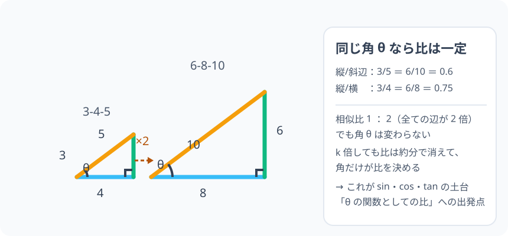

# 相似と比率の普遍性：形が同じなら、辺の比はどこでも同じ

> [!abstract] このノードの核心
> 拡大・縮小しても**形が変わらない**図形を相似という。相似な 2 つの三角形では 3 つの角がすべて等しく、対応する 3 辺の比はすべて同じ値（相似比）になる。**この「角が決まれば辺の比が決まる」性質が、三角比（sin・cos・tan）の出発点である。**

> [!success] 合格ライン
> 相似の定義と 2 つの相似条件（2 角が等しい・3 辺の比）を使って、30-60-90 の三角形が 2 倍になっても「高さ/斜辺 = 1/2」のままであることを説明できる。対応する角を正しく対応付けられる。

## 記号の読み方

| 表記 | 読み方 | この教材での意味 |
|---|---|---|
| ∽ | そくじ（の記号） | 相似であることを示す記号 |
| 相似 | そうじ | 形が同じ（大きさは違ってもよい） |
| 相似比 | そうじひ | 対応する辺の長さの比 |
| 対応する辺 | たいおうするへん | 相似のとき、位置が対応する辺同士 |

> [!tip] 対応は名前の順で決まる
> $\triangle ABC \propto \triangle DEF$ と書いたとき、A ↔ D、B ↔ E、C ↔ F の順で対応する。△ABC の辺 AB に対応するのは △DEF の辺 DE。

## 前提ノードと入口判定

機械的な前提関係は、プロジェクト内スナップショット `../ontology/math_euler_complete_ontology.json` を参照し、転記している。外部原本は `G:/マイドライブ/Eleanor Arroway/documents/math_euler_complete_ontology.json`。`trigonometry_master_ontology.md` は人間向けの全体地図として使い、IDや依存関係が異なる場合はJSONを優先する。

| 区分 | ノード・知識 | この教材で必要な理由 | 入口での判定 |
|---|---|---|---|
| 必須ノード（JSON正本） | `ELEM-RATIO-01` 分数と比・割合 | 相似比・辺の比を扱うため。比 = 割り算の感覚 | 3 : 5 = 3/5 と読める。6/10 が 3/5 と同じ値だと分かる |
| 必須ノード（JSON正本） | `JH-GEO-TRI-CONG-01` 直角三角形の性質と合同 | 三角形の見方（対応する辺・角・合同）の土台 | 斜辺と鋭角 1 組が等しい直角三角形は合同だと分かる |
| 基礎知識（ノード外） | 三角形の内角の和 | 相似条件「2 角が等しい」から 3 つ目も等しくなる理由 | 内角の和 = 180° から残りの角の大きさを求められる |

**入口判定の扱い:** JSON の診断問題（30-60-90 を 2 倍しても高さ/斜辺の比は変わらないか）を最初の目安にする。「2 倍しても 1/2 のまま」という直感はあってよい。**その直感を「なぜ」の言葉で言えるようになること**が本ノードの目標なので、後で P0 で確かめる。

## 到達点

この教材を閉じたとき、次のことを自分の言葉で説明できる。

- 相似とは何か（形が同じ・大きさは違う）を定義できる。
- 対応する角・対応する辺を名前の順で対応づけられる。
- 相似条件（2 角が等しい・3 辺の比・2 辺の比と夾角）で相似を判定できる。
- 30・60・90° の直角三角形がどんな大きさでも同じ形であり、辺の比が「1 : √3 : 2」で不変なことを導ける。
- この「角が決まれば辺の比が決まる」が、sin・cos・tan の根拠になることを説明できる。

## 入口：写真を 2 倍にすると何が変わる？

写真を拡大しても「形」は変わらない。実際に教室の机の写真を 2 倍プリントすると、縦も横も斜めの線もすべて 2 倍になり、机の形は同じである。**「全長が同じ倍率で変わる」ことが、形が乱れない理由**である。

> [!example] 同じ例を最後まで使う
> 「3-4-5 の直角三角形」を「2 倍すると 6-8-10」として、この教材のどこでも同じ三角形を使う。比例の長さの関係 → 斜辺・棒・比の確認。

## 核となる図

図では小さい三角形の縦・横・斜辺（3・4・5）と、それぞれ 2 倍の（6・8・10）を対応して並べている。**3 つの辺がどれも同じ倍率で伸びている**ことが「形が同じ」である。

| 図での要素 | 名前 | 役割 |
|---|---|---|
| 小さい三角形 | 3-4-5 | 基本の形 |
| 大きい三角形 | 6-8-10 | 2 倍した形 |
| 対応する辺 | 対応線 | 縦同士・横同士・斜辺同士を表す |
| θ マーク | 同じ角 | 角が変わっていないことが同位角 | 
| 倍率の束 | 相似比 | 2 倍なら 1 : 2 |

## まずやってみる

> [!question] 式を見る前の10秒
> 3-4-5 の三角形を 2 倍・3 倍したときの 3 辺の長さを予想し、それぞれの「斜辺/ライブ線」の比（ここでは「高さ/斜辺」の意味）を計算して、そこにどんな共通点を見つけるか。

答えを確認する

2 倍 → 6-8-10、3 倍 → 9-12-15。各々の「縦 / 斜辺」= 3/5 = 6/10 = 9/15 = 0.6。**比はどこまで拡大しても変わらない**。

## 相似の定義と対応

2 つの図形について、一方を拡大（または縮小）すると他方と重なるとき、この 2 つを**相似**であるといい、$\triangle ABC \propto \triangle DEF$ のように書く（∽ の記号）。相似な三角形では

- 対応する角がすべて等しい
- 対応する辺の比がすべて等しい（この比を**相似比**）

この 2 つはセットである。対応の仕方は、頂点の名前の順で決まる（△ABC と △DEF なら A ↔ D、B ↔ E、C ↔ F）。

## 相似条件：何を確かめればよいか

三角形の相似は、次の 3 つのいずれかが言えれば確実に成立する。

| 条件 | 中身 | 感覚 |
|---|---|---|
| 2 角が等しい | 2 組の角が等しい → 3 つ目も自動的に等しい（内角の和 180°） | 角と角だけで決まる |
| 2 辺の比と夾角 | 2 組の辺の比が等しく、その間の角が等しい | 2 辺と先の角 |
| 3 辺の比が全て等しい | 3 組すべての辺の比が相似比で等しい | 辺だけできまる |

**「2 角が等しい」だけでも相似である**理由：三角形の内角の和は 180° の固定値。2 つの角がわかれば残り 1 角は自動的に埋まるので、3 つ目が変わることがない。

## 導出：角が決まれば、辺の比が決まる

ここがこのノードの核心。直角三角形の各辺をすべて同じ倍率 k で伸ばすと、拡大後の「縦・横・斜辺」はそれぞれ元の k 倍になる。このときどの辺の比を取っても、k は分子分母に同じだけ入るので約分で消える。

$$
\frac{\text{拡大後の縦}}{\text{拡大後の斜辺}} = \frac{k \times \text{元の縦}}{k \times \text{元の斜辺}} = \frac{\text{元の縦}}{\text{元の斜辺}}
$$

**「k が分子分母で約分されて消える」ことが核心である。** この比は、三角形の大きさに無関係に、角 θ だけで決まる。

逆に言えば、ある角 θ に対して「縦/斜辺」や「縦/横」という比は一意に定まる。この比こそが、後の $\sin\theta$・$\cos\theta$・$\tan\theta$ に名前をもらうものだ。

## 数値で点検する

- **3-4-5 → 6-8-10**：縦/斜辺 = 3/5 = 6/10 ✓
- **30-60-90**：辺の比は 1 : √3 : 2（正三角形を半分にした形）。どんな大きさでもこの比。
- **45-45-90**：1 : 1 : √2。これも不変。
- 極端な場合：相似比 1（合同）でも比は同じ。

## 3行まとめ

1. 相似とは、拡大・縮小しても形が同じこと。対応する角は等しく、対応する辺の比は一定。
2. 三角形は「2 角が等しい」だけで相似が言える（内角の和 180° から 3 つ目も等しい）。
3. 辺の比が k 倍で約分されて消えるから、角 θ だけで「縦/斜辺」などの比が決まる。→ 三角比の出発。

## 理解度サポート：どこまで分かっているか

### まず自己評価

- [ ] **0：未学習** — 相似の言葉がない
- [ ] **1：見れば分かる** — 図で対応を見られる
- [ ] **2：自力で解ける** — 相似条件で判定できる
- [ ] **3：説明できる** — 角だけで比が決まる理由を、k の約分と内角の和の両方で説明できる

### 技能ごとの確認問題

| check_id | 確認する技能 | 問い | 答えが曖昧なときに戻る場所 |
|---|---|---|---|
| P0 | JSON指定の入口診断 | 30°, 60°, 90° の直角三角形を 2 倍にしても「高さ/斜辺」の比は変わらないか。理由も答えよ。 | 「導出」 |
| C1 | 対応を読む | $\triangle ABC \propto \triangle DEF$ で、A に対応する頂点・AB に対応する辺を答えよ。（答: D・DE） | 「相似の定義と対応」 |
| C2 | 相似条件 | 「2 角が等しい」だけで相似と言ってよい理由を、内角の和から説明する。 | 「相似条件」 |
| C3 | 相似比の計算 | 3-4-5 と 6-8-10 の相似比を求め、3 辺すべてで成立することを確認する。（答: 1:2） | 「数値で点検する」 |
| C4 | k の約分 | 3x・4x・5x の直角三角形について、縦/斜辺 = 3/5 であることを x の約分で導く。 | 「導出」 |
| C5 | 三角比への橋 | 「角度だけが決める比」が、どうして角度の名前である sinθ・cosθ を作ることになるかを説明する。 | 「次のノードへの橋」 |

解答と判定基準を開く

- **P0の答え:** 変わらない。1 : √3 : 2 の比を 2 倍すると 2 : 2√3 : 4 になるが、30° の対辺（短い辺）/斜辺 = 1/2 のまま。分母分子の 2 が約分で消える。
- **C1の答え:** A ↔ D、AB ↔ DE。
- **C2の答え:** 内角の和が 180° で固定なので、2 つが等しければ 3 つ目も自動で等しい。
- **C3の答え:** 相似比 1 : 2。3:6 = 4:8 = 5:10 = 1:2。
- **C4の答え:** 縦/斜辺 = (3x)/(5x) = 3/5。x が約分される。
- **C5の答え:** sin θ は「θ が決まれば確定する比」に名前を付けたもの。相似比の普遍性が「θ だけの関数」を可能にする。

**判定の目安:**

- P0とC1〜C5を正答かつ理由つきで → 次のノードへ
- C1を誤る → 対応の言葉を復習（名前の順）
- C2を誤る → 相似条件の根拠（内角の和）
- C4を誤る → k の約分を一枚ずつ書き直す

## よくある取り違え

- **相似と合同のごちゃまぜ** → 合同は「大きさも形も同じ」、相似は「形だけ同じ（大きさは違ってもよい）」。
- **対応する並び** △ABC ∽ △DEF で、AC と DF の対応を間違える → **名前の順序で対応づける**。
- 「2 角が等しいのは十分条件だけ」→ 心配不要。**三角形では 2 角で十分**（3 つ目は固定だから）。
- **相似比と面積比の混同** → 面積の比は（相似比）² になる（少し先の話題。今は辺の比まで）。
- **どの角でも比が同じと思い込む** → 角 θ が変われば比は変わる（30° なら 1/2、60° なら √3/2 など）。**θ ごとに固有の比**。

## 自力確認（teach-back）

教材を閉じて、次を声に出して答える。

1. 相似の定義を述べ、相似条件 3 つを列挙する。
2. 3-4-5 と 6-8-10 の間で、辺の比が相似比 1:2 になっていることを 3 辺すべてで示す。
3. 「大きさを変えても縦/斜辺が変わらない」ことを図、言葉、数式（k の約分）の 3 つで示す。
4. この性質が三角比の「角 θ の関数」を構成する理由を説明する。

## 次のノードへの橋

相似は、高校の三角比の**理論的な土台**である。

- `HS1-TRIG-DEF-01`：$\sin\theta = \text{対辺}/\text{斜辺}$ の「分母・分子は辺の長さそのものではなく、相似の比（の普遍性）」である。ここで「比」の言葉が、今作ったばかりの言葉と一致する。
- `JH-GEO-PYTHAGORAS-01`：三平方の定理の証明の多くも相似を利用する（直角三角形の中の相似から a² + b² = c² が出る）。

## インタラクティブ化の候補（レビュー後に判定）

- **有効候補: 三角形の拡大（スライダーで倍率）** — 3-4-5 を k 倍したときに、3 辺の表示と各比（3/5 など）が不変であることをリアルタイムで見る。相似=比不変の体験。
- **有効候補: 30-60-90 の 2 倍（直角三角形）** — 特別な直角三角形の拡大は、診断 P0 を先に体験するのに最適。
- **静的なままで十分:** 完全に静止していても比の不変性（k の約分）は説明できるが、拡大スライダーは 1 つだけ選ぶ価値がある。
- 動かすことそれ自体を合格条件にはしない。
