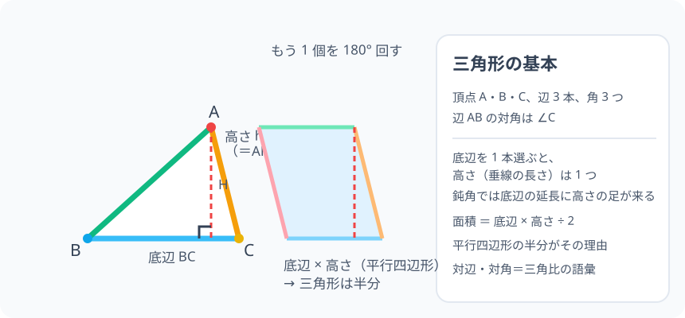

# 三角形の基本：3 つの点でできる最も丈夫な形

> [!abstract] このノードの核心
> 三角形は「3 つの頂点・3 本の辺・3 つの角」からなる最もシンプルで強度のある平面図形である。**「底辺」を 1 本決めると、それに対する「高さ」（頂点から底辺への垂線）が 1 対 1 で決まる**。面積は「同じ三角形をもう 1 個ひっくり返して合わせると平行四辺形になる → その半分」の構造。

> [!success] 合格ライン
> 三角形の頂点・辺・角を指して数えられ、底辺を決めたときの高さ（垂線）の意味を説明できる。直角三角形を描いて「底辺に垂線を立てる」行為ができる。面積＝底辺×高さ÷2 の理由を、平行四辺形の半分として説明できる。

## 記号の読み方

| 表記 | 読み方 | この教材での意味 |
|---|---|---|
| △ABC | さんかくけい・エービーシー | 頂点 A・B・C の三角形 |
| 頂点 | ちょうてん | 辺の先の点。3 つある |
| 辺 AB | へん・エービー | 頂点 A と B を結ぶ線分 |
| ∠A | かく・エー | 頂点 A で作られる角 |
| 底辺 | ていへん | ものさしの基準にする 1 辺（好きな辺でよい） |
| 高さ | たかさ | 残りの頂点から底辺へ下ろした垂線の長さ |

> [!tip] 「∠A」は「角A」と読む
> ∠ は「角」の記号。∠A は「頂点 A の角」、∠ABC は「頂点 B の角（BA と BC がなす角）」。

## 前提ノードと入口判定

機械的な前提関係は、プロジェクト内スナップショット `../ontology/math_euler_complete_ontology.json` を参照し、転記している。外部原本は `G:/マイドライブ/Eleanor Arroway/documents/math_euler_complete_ontology.json`。

このノードはオントロジー上の幾何の起動点である（prerequisites: なし）。前提は次の 2 つの日常・小学校層の感覚だけ：

| 区分 | 知識 | 必要な理由 | 入口での判定 |
|---|---|---|---|
| C類（日常・小学校層） | 三角形・点・辺の言葉 | すべての図形論の前提である | 部屋のピースを 3 つつなげた形を指せる |
| C類（日常・小学校層） | 垂直・高さの見た目（縦の線） | 高さの垂線の導入 | 三角定規を直角に使う意味を伝えられる |

**入口判定の扱い:** JSON の診断問題「底辺と高さを指して、面積が底辺×高さ÷2 の理由を言えるか」を最初の目安にする。このノードは学習前から「なんとなく言えるかも」から始める。**学び終えた後に言葉で理由を言える**ことが合格ライン。

## 到達点

この教材を閉じたとき、次のことを自分の言葉で説明できる。

- 三角形の頂点・辺・角の構成を指し示せる。
- 「底辺」を 1 本選ぶと、残る頂点と底辺から「高さ」が決まる理由。
- 面積 = 底辺 × 高さ ÷ 2 を、平行四辺形の半分として説明できる（同じ三角形を 2 つ）。
- 鈍角の三角形で高さの足が底辺の延長（外側）にある場合を説明できる。

## 入口：「最も強いカタチ」はなぜ三角形なのか

三角形は 3 点で作られ、他の多角形と違って、形をぐにゃりと変える自由度が 1 つもない（正方形はならすと平行四辺形にひしゃげるが、三角形はならない）。だから構造物にも数学にも、三角形は計量の出発点になる。そして測量の道具として使うのが**底辺と高さ**である。

> [!example] 同じ例を最後まで使う
> △ABC を「底辺 = BC（横の辺）、頂点 = A（上）」の図形に設定し、高さ AH・面積・鈍角のケースまで使いまわす。

## 核となる図

図の左：底辺 BC と高さ AH（破線・直角マーク）。図の右：同じ三角形を 1 個ひっくり返してくっつけると平行四辺形ができる。**平行四辺形の面積は（底辺×高さ）であり、三角形はその半分。**

| 図での要素 | 名前 | 役割 |
|---|---|---|
| BC | 底辺 | 長さを測る基準の辺 |
| AH | 高さ | 頂点 A から底辺へ下ろした垂線 |
| 破線の三角形 | 回転させた 1 枚 | 平行四辺形を作る相手 |
| 平行四辺形 | 全体 | 三角形のちょうど 2 枚分 |

## まずやってみる

> [!question] 式を見る前の10秒
> 底辺 4・高さ 3 の三角形は、面積いくら？ どの「底辺」を選んでも同じ答えになるか、図を見て測ってみる（ヒント：敷き詰め）。

答えを確認する

4 × 3 ÷ 2 = 6。底辺と高さは「どれを底辺にしても」高さが付け替わるだけで、面積は同じ 6 になる（三角形は 1 つだけだから）。

## 三角形の構成：頂点・辺・角

三角形は 3 つの点（頂点）を 3 本の線分（辺）で結んだ、3 つの内角（角）を持つ図形である。

$$
\text{頂点 3 つ ＋ 辺 3 本 ＋ 角 3 つ}
$$

- 表記：△ABC
- 辺にかかるラベル：辺 AB・辺 BC・辺 CA
- 角：∠A（∠BAC）・∠B（∠ABC）・∠C（∠BCA）

**辺 AB と ∠C の関係（対辺・対角）**：辺 AB に向かい合わせられる角が ∠C。「向かい合わせ」のペアを後々（三角比）で何度も使う。

## 底辺と高さ：垂線の 1 対 1 対応

### 決まり方

底辺として 1 本の辺（BC）を選ぶ。このとき**高さ**は「残りの頂点 A から、底辺 BC に垂直な直線を引いて、その長さ」と決まる。

$$
\text{高さ } h:\ \text{頂点から底辺へ下ろした垂線の長さ}
$$

垂線の足 H が底辺の上に来るとは限らない（鈍角三角形では底辺の「延長」上に来ることがある）。図のように、**高さは外にも「あってよい」**。

### なぜ図形としては常に決まるか

底辺を選ぶと、残る頂点は 1 つだけであり、その点から垂線は 1 本だけ引ける（垂直の一意性）。よって、底辺と高さは 1 対 1。

## 面積の公式（平行四辺形から導く）

### ステップ 1：もう 1 枚用意する

同じ△ABC のコピーを 1 枚作り、辺 BC の回りに 180° 回転してつなげる。この結果できるのは平行四辺形（対辺が平行な四角形）である。

### ステップ 2：平行四辺形の面積

平行四辺形の面積は「底辺 × 高さ」——この事実は細かくは「長方形に切って並べ替える」ことで導かれる。かけ算のまま良い。

### ステップ 3：三角形はその半分

$$
\text{三角形の面積} = \frac{1}{2} \times (\text{底辺} \times \text{高さ}) = \frac{\text{底辺} \times \text{高さ}}{2}
$$

## 数値で点検する

- 底辺 4・高さ 3 → 6。
- 底辺 5・高さ 2 → 5。
- 極端に偏った三角形（一方の角が 120° の鈍角三角形）：同じく 6 で一定（底辺を変えずに頂点が動くだけ）。

## 3行まとめ

1. 三角形は頂点 3・辺 3・角 3 の最小平面図形で、△ABC の表記と ∠A の記法を使う。
2. 底辺を 1 本定めると、高さ（垂線の長さ）は 1 つに決まる。鈍角なら底辺の延長に足を置く。
3. 面積 =（底辺 × 高さ）÷ 2。理由は平行四辺形の半分。

## 理解度サポート：どこまで分かっているか

### まず自己評価

- [ ] **0：未学習** — 三角形の構成を指せない
- [ ] **1：見れば分かる** — 図を見ながらなら構成を言える
- [ ] **2：自力で使える** — 底辺・高さを選んで面積を計算できる
- [ ] **3：説明できる** — 平行四辺形の半分・鈍角の注意を言える

### 技能ごとの確認問題

| check_id | 確認する技能 | 問い | 答えが曖昧なときに戻る場所 |
|---|---|---|---|
| P0 | JSON指定の入口診断 | 底辺と高さを指し、面積が底辺×高さ÷2 になる理由を言う。 | 「面積の公式」 |
| C1 | 構成 | △ABC の頂点・辺・角をそれぞれ 3 つ挙げる。 | 「三角形の構成」 |
| C2 | 対辺・対角 | 辺 AB の対角は？（答: ∠C） | 「三角形の構成」 |
| C3 | 高さの引く場所 | 底辺 BC・頂点 A のとき、高さ AH を図に描ける。鈍角の場合は？ | 「底辺と高さ」 |
| C4 | 面積 | 底辺 6・高さ 4 → ？（答: 12） | 「数値で点検する」 |
| C5 | 三角比の布石 | 「辺 AB の対角 = ∠C」が、後に三角比のどの使い道とつながるか述べる。 | 「次のノードへの橋」 |

解答と判定基準を開く

- **P0の答え:** 同じ三角形をもう 1 枚作って 180° 回すと平行四辺形。その面積（底辺×高さ）の半分が三角形の面積。
- **C1の答え:** 頂点 A・B・C、辺 AB・BC・CA、角 ∠A・∠B・∠C。
- **C2の答え:** ∠C。
- **C3の答え:** 頂点 A から底辺 BC に垂直な線。鈍角の場合は底辺を延長した線の上に足が来る。
- **C4の答え:** 6 × 4 ÷ 2 = 12。
- **C5の答え:** 「対辺と対角のペア」が正弦定理（辺 a の対角が A）や三角比（sinA = 対辺/斜辺）の基本対応になる。

**判定の目安:**

- P0とC1〜C5を正答かつ理由つきで → 次のノードへ
- C3を誤る → 図を描いて垂線の足を緑で塗る（底辺延長のケースを見る）
- C2を誤る → 対辺・対角の対応を確認（向かい合わせ）

## よくある取り違え

- 「底辺は決まっている」と思う → **底辺は自分で選べる、どの辺でも良い**（高さは付替わる）。
- 高さを「頂点から底辺への斜めの線」と混同 → **垂直に降ろした線。垂線と三角形の辺は違う**。
- 高さは必ず中に収まると考える → **鈍角では外に出る（底辺の延長）**。
- 底辺×高さだけで面積を済ませる → **÷2 を忘れない（平行四辺形との関係）**。
- 面積計算は多角形すべてで同じと思う → **三角形は (底辺×高さ)/2。平方根は不要。多角形は分割**。

## 自力確認（teach-back）

教材を閉じて、次を声に出して答える。

1. △ABC の構成（頂点・辺・角）を言葉で言う。
2. 底辺 BC と頂点 A に対する高さを、図を描かずに説明する。
3. 面積公式を平行四辺形の半分の議論として説明する。
4. 鈍角の三角形の「高さは外に立つ」を具体例で話す。

## 次のノードへの橋

このノードの目的は「対辺と対角・高さと垂線・面積の基礎」を、三角形の計量の出発点にすることである。

- **直角の向こう（`JH-GEO-PARALLEL-01`）**：同位角・錯角・内角の和 180°。平行線の言葉を手に入れる。
- **合同（`JH-GEO-TRI-CONG-01`）**：2 つが「ピッタリ重なる」ための条件の学習へ。
- **三角比（`HS1-TRIG-DEF-01`）**：対辺・隣辺・斜辺は、このノードの「対辺・対角」の語彙の使い方そのものである。

## インタラクティブ化の候補（レビュー後に判定）

- **有効候補: 対の三角形を動かして平行四辺形を組んでみる** — 面積の「半分」が視覚的に 積み直せる。
- **有効候補: 頂点をドラッグして高さの足の内外を見る** — 鈍角の「高さが外に出る」発見。
- **静的なままで十分:** 図・式・説明で成立。トライするなら 2 番目のドラッグ。
- 動かすことそれ自体を合格条件にはしない。
