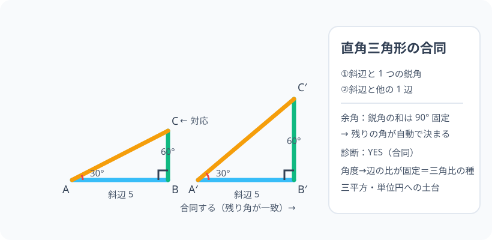

# 直角三角形の性質と合同：直角が 1 つあるぶん、条件は 1 つ軽い

> [!abstract] このノードの核心
> 三角形の合同条件は「3 辺・2 辺と挟角・1 辺と 2 角」の 3 つ。しかし直角三角形では、**直角 1 つが最初から分かっている**ので、条件が 1 つ減る——「斜辺＋鋭角」「斜辺＋他の 1 辺」の 2 つが使える。その根拠も、残り 1 角が内角の和から自動で決まる（余角）ための 1 事実である。

> [!success] 合格ライン
> 直角三角形の合同条件 2 つ（斜辺と鋭角・斜辺と 1 辺）を言え、**「斜辺＋鋭角」で合同が言える理由**（残りの角が自動で決まる）を説明できる（＝診断の答え：はい）。鋭角の和 90°（余角）も言える。

## 記号の読み方

| 表記 | 読み方 | この教材での意味 |
|---|---|---|
| 斜辺 | しゃへん | 直角の向かい側の辺（最長） |
| 鋭角 | えいかく | 0° より大きく 90° より小さい角 |
| 余角 | よかく | 足すと 90° になる角のペア |
| 合同 | ごうどう | ピッタリ重なる 2 つの図形 |

> [!tip] 直角と鋭角
> 直角三角形の角は「直角（90°）×1・鋭角 ×2」。2 つの鋭角の和は常に 90°（余角）。

## 前提ノードと入口判定

機械的な前提関係は、プロジェクト内スナップショット `../ontology/math_euler_complete_ontology.json` を参照し、転記している。外部原本は `G:/マイドライブ/Eleanor Arroway/documents/math_euler_complete_ontology.json`。`trigonometry_master_ontology.md` は人間向けの全体地図として使い、IDや依存関係が異なる場合はJSONを優先する。

| 区分 | ノード・知識 | この教材で必要な理由 | 入口での判定 |
|---|---|---|---|
| 必須ノード（JSON正本） | `JH-GEO-PARALLEL-01` 平行線・角・内角の和 | 残りの角が 180° から決まる仕組み（余角） | 三角形の内角の和 = 180° を言える |
| 基礎知識（前ノード系） | 三角の語彙（TRI-BASIC） | 斜辺・辺の名称 | 直角三角形の斜辺を指せる |

**入口判定の扱い:** JSON の診断問題「斜辺と鋭角が等しい 2 つの直角三角形は合同か？」を最初の目安にする。**直感的には「ぴったり」なのだが**、理由（残り角が決まる）まで言えることが合格ライン。P0 で詳話。

## 到達点

この教材を閉じたとき、次のことを自分の言葉で説明できる。

- 直角三角形の合同条件 2 つ（斜辺＋鋭角・斜辺＋他辺）を言える。
- 「斜辺＋鋭角で十分」となる理由を、余角（内角の和）から説明できる。
- 一般の合同条件 3 つ（3 辺・2 辺と挟角・1 辺と 2 角）を、直角三角形の場合に軽量化できる。
- 30-60-90 の三角定規が、この合同条件（斜辺＋鋭角）を知り尽くした道具であることを言える。

## 入口：「三角定規は、いちいち測り直さない」

検品する人・測量する人は「正しい三角形と角が合っているか」を最速で確認したい。一般的な三角形なら 3 辺・2 辺と挟角・1 辺と 2 角が要る。でも**直角三角形に限ると条件が 1 つ軽くなる**。この「軽くなる仕組み」が、このノードの全て。

> [!example] 同じ例を最後まで使う
> 30° の三角形（三角定規の型）を主役にし、斜辺・鋭角・残り角（60°）・余角の関係で通す。

## 核となる図

図の左・右、同じ「斜辺 5・鋭角 30°」の直角三角形。**それぞれの残り角は自動で 60°**（内角の和 180°−90°−30°）になるので、角 3 つがすべて一致する。あとは辺の対応（斜辺）から全身がピッタリ。

| 図での要素 | 名前 | 役割 |
|---|---|---|
| 斜辺 5 | 対応辺 | 長さ同じ |
| 鋭角 30° | 対応角 | 同じ角 |
| 残り角 60° | 自動で一致 | 内角の和の帰結 |
| 直角 90° | 共通 | 元々ある権利 |

## まずやってみる

> [!question] 式を見る前の10秒
> 斜辺 5・鋭角 30° の直角三角形は、もう 1 つの鋭角が何度か。その三角形の「角の情報」は 3 つとも確定するか？

答えを確認する

残り 60°（180−90−30）。角の情報は 3 つとも確定。加えて斜辺 5 も同じ → 大きさまで確定 → 合同。

## 直角三角形の合同条件（特別 2 つ）

一般の三角形の合同条件（3 辺・2 辺と挟角・1 辺と 2 角）のうち、直角三角形では次が使える：

$$
\boxed{\ \text{①斜辺と 1 つの鋭角}\ \quad\quad \boxed{\ \text{②斜辺と他の 1 辺}\ }}
$$

（「斜辺と鋭角」「斜辺と 1 辺」の 2 つ。これは 一般の三角形では使えない。）

### なぜ ①が成立するか（余角の力）

三角形の内角の和は 180°。直角三角形では 90° が既知なので、

$$
\text{鋭角 1 つが決まる} \Rightarrow \text{残りの鋭角も自動（180°−90°−θ）}
$$

つまり「斜辺＋鋭角」で、**角の情報 3 つが全部そろう**。そこに斜辺という 1 辺の情報が加わり、三角形は一意（1 辺と 2 角に帰着）→ 合同。

### ②はなぜ成立するか

「斜辺＋他の 1 辺」。3 辺のうち 2 辺が決まり、直角が決まっているので三角形は確定する（残る 1 辺は測定しなくても同じ）。ここは中 3 の三平方の定理でも「残り 1 辺が決まる」と確認できる。

## 数値で点検する

### 診断問題

$$
\text{斜辺と 1 つの鋭角が等しい 2 つの直角三角形}：\text{合同} YES
$$

（理由：余角で残る角も一致 → 1 辺と 2 角の合同条件。）

### 30-60-90 の三角定規ペア

斜辺 = 2a タイプ、残り角 60°。斜辺と 30° を合わせればもう 1 枚と合同 ✓

### 極端な場合

- 直角が「90° でなく 89°」の三角形では、この特別条件は使えない（一般の合同条件へ）。
- 斜辺だけで 2 角が分からない → わからない（斜辺だけでは決まらない）。

## 3行まとめ

1. 直角三角形は「直角 1 つが与えられた状態」→ 合同条件が 1 つ軽くなる。
2. 特別条件：「斜辺＋鋭角」「斜辺＋他の 1 辺」。
3. その根拠は余角（鋭角の和 90°）——残りの角が自動で決まる。

## 理解度サポート：どこまで分かっているか

### まず自己評価

- [ ] **0：未学習** — 合同条件の一覧を知らない
- [ ] **1：見れば分かる** — 図の対応を追える
- [ ] **2：自力で使える** — 直角三角形の判定ができる
- [ ] **3：説明できる** — 余角・一般条件との違いを説明できる

### 技能ごとの確認問題

| check_id | 確認する技能 | 問い | 答えが曖昧なときに戻る場所 |
|---|---|---|---|
| P0 | JSON指定の入口診断 | 斜辺と1つの鋭角が等しい2つの直角三角形は合同ですか？ | 「数値で点検する」 |
| C1 | 特別条件 | 直角三角形の合同条件 2 つを列挙する。 | 「合同条件」 |
| C2 | 余角 | 45° の直角三角形のもう 1 つの鋭角（答: 45°） | 「①の成立理由」 |
| C3 | 一般でない | 「斜辺と鋭角」が一般三角形で使えない理由。 | 「①の成立理由」 |
| C4 | 判定 | 斜辺 10・鋭角 40° はもう 1 つの三角形と合同か、判断と根拠。 | 「数値で点検する」 |
| C5 | 三角比の道 | この「角度が 1 つ決まると辺の比も決まる」が三角比の何に続くか。 | 「次のノードへの橋」 |

解答と判定基準を開く

- **P0の答え:** 合同。残りの鋭角が自動で等しくなり、1 辺と 2 角の合同条件に帰着する。
- **C1の答え:** ①斜辺と 1 つの鋭角 ②斜辺と他の 1 辺。
- **C2の答え:** 45°（一致するのは直角二等辺三角形のとき）。
- **C3の答え:** 一般の三角形では「斜辺」という特別な辺の指定ができず、1 辺と 1 角だけでは決まらない。
- **C4の答え:** はい。共に斜辺 10・残り角 50°（余角）・直角 → 1 辺と 2 角の合同。
- **C5の答え:** 角が同一なら比（斜辺を辺で）が同一（similar）。それが sinθ・cosθ の「角の関数」の構造の序章。

**判定の目安:**

- P0とC1〜C5を正答かつ理由つきで → 次のノードへ
- C3を誤る → 一般三角形では「直角」が誰も教えてくれない、という視点
- C4を誤る → 余角の計算（180−90−40 = 50）

## よくある取り違え

- 「斜辺と鋭角」を一般三角形に使う → **直角三角形だけの条件（一般は 1 辺と 2 角）**。
- 余角 90° と鈍角 180°（補角）を混同 → **余角=足すと 90°・補角=足すと 180°**。
- 合同と相似を混同 → **合同はピッタリ重なる・相似は形だけ（アフィン縮小可）**。
- 斜辺の位置を取り違える → **斜辺は直角の向かい側（直角を挟むのが他の 2 辺）**。
- 証明の「中点・二等分」に合わせずとも、合同条件 2 つで確認する → **この 2 つは「直角三角形で使える条件」、と気軽に**。

## 自力確認（teach-back）

教材を閉じて、次を声に出して答える。

1. 直角三角形の合同条件 2 つと、一般 3 つとの差を説明する。
2. 「斜辺＋鋭角」が成立する理由を余角の計算で示す。
3. 斜辺 5・角度 30° の 2 つの直角三角形の合同を、角 3 つをそろえて確かめる。
4. 三角比の定義（sin・cos）への道のり（角→比が一定）の必然性を一言。

## 次のノードへの橋

- **三角比（`HS1-TRIG-DEF-01`）**：このノードの「角が決まれば残りが決まり、辺の比も固定」が、sinθ・cosθ・tanθ の定義の意味そのもの。
- **三平方（`JH-GEO-PYTHAGORAS-01`・中3）**：斜辺と 1 辺から残り辺（三平方）。
- **単位円（`HS1-TRIG-UNITCIRCLE-01`）**：斜辺を 1 に固定した相似の家族の 1 枚としての視点。

## インタラクティブ化の候補（レビュー後に判定）

- **有効候補: 2 つの三角形を重ねる制御** — 対応角（30°→60°）をスライダーにして同じく表示。
- **有効候補: 合同判定の問題** — 条件チェックリスト（答えは一定でない）をタブ化。
- **静的なままで十分:** 図・条件・理由は静的で成立。動かすなら 1 つ目。
- 動かすことそれ自体を合格条件にはしない。
