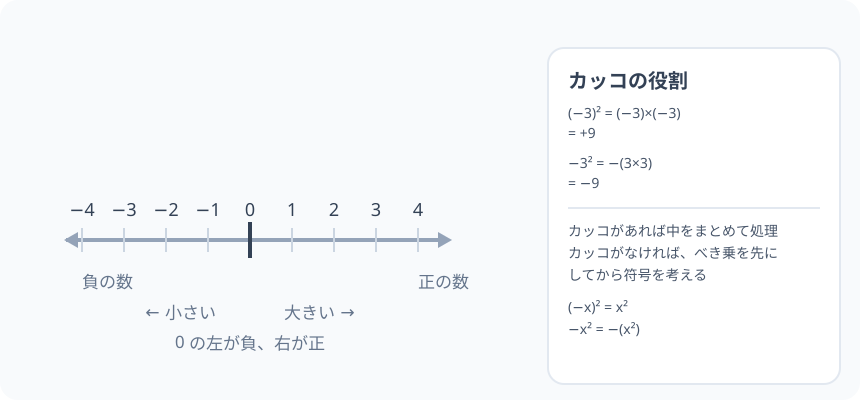

# 負の数：0 の左側の世界と、符号の代数

> [!abstract] このノードの核心
> 0 より小さい数（負の数）は「ないもの」ではなく、**数直線の 0 の左側にある、ちゃんとした位置の数**である。マイナスの符号は「引き算の符号」でも「数の符号」でもあり、同じ記号を 2 つの意味で使う――それが多くの取り違えの源。

> [!success] 合格ライン
> 数直線上で正・負・0 の位置関係を言え、負の数の加減・乗除の規則を分配法則から説明でき、$(-3)^2 = 9$ と $-3^2 = -9$ の違いを「カッコの役割」で説明できる。

## 記号の読み方

| 表記 | 読み方 | この教材での意味 |
|---|---|---|
| 負の数 | ふのすう | 0 より小さい数。数直線上では 0 の左側 |
| `−3` | マイナスさん | 負の数。読み方と意味が一致する |
| `(−3)²` | マイナスさん（の）二乗 | カッコの全体を 2 乗 |
| `−3²` | マイナス、さん二乗 | 3 を 2 乗した結果の符号を反転 |
| 符号 | ふごう | 数についた「+」・「−」のマーク |

> [!tip] 音読するとき
> マイナスの配置を必ずカッコまでセットで読む。`(−3)²` は「カッコ、マイナス三、を二乗」、`−3²` は「マイナス、三の二乗」。どちらの読み方になるかで計算順が違う。

## 前提ノードと入口判定

機械的な前提関係は、プロジェクト内スナップショット `../ontology/math_euler_complete_ontology.json` を参照し、転記している。外部原本は `G:/マイドライブ/Eleanor Arroway/documents/math_euler_complete_ontology.json`。`trigonometry_master_ontology.md` は人間向けの全体地図として使い、IDや依存関係が異なる場合はJSONを優先する。

| 区分 | ノード・知識 | この教材で必要な理由 | 入口での判定 |
|---|---|---|---|
| 必須ノード（JSON正本） | `ELEM-NUM-01` 四則演算と小数の計算 | 負の数 0 より小さい数の足し算・引き算・掛け算は、小学校の数で使える計算技能 | 0.1 + 0.2・3 × 0.5 などの整数・小数の計算ができる |
| 基礎知識（ノード外） | 数直線 | 数の「位置」を視覚化し、大小関係を壊さないため | 0 より大きい数は右、小さい数は左、という向きの関係を言える |

**入口判定の扱い:** JSON の診断問題「$(-3)^2$ と $-3^2$ の違いを説明できますか？」を最初の目安にする。**この診断は、このノードを学んでから答えてもよい**（学んだ後に P0 で再試行）。初回に「どっちか覚えていない」と答えても、後に上進できるように、判定は後の確認テストで行う。

## 到達点

この教材を閉じたとき、次のことを自分の言葉で説明できる。

- 負の数が数直線のどこにいるか、正の数・0 とどう並んでいるか。
- 加法・減法・乗法・除法の符号の規則を計算でき、負×負が正になる理由を分配法則で「つじつまが合うこと」として説明できる。
- $(-3)^2$ と $-3^2$ の違いを、計算順序とカッコの意味で説明できる。
- 絶対値（符号を取った大きさ）を距離として説明できる。

## 入口：困った時に現れる「マイナスの数」

人は寒いのを $-10$ 度と書き、借金を $-3$ 万円とつける。ここに「−」の数はいつの間にか身の回りにいる。数学ではこれを、数を「素直に」扱えるきそとして整える。

> [!example] 同じ例を最後まで使う
> 温度（$-10$ 度）、借金（$-3$ 万円）、階段で下がる（$-4$ 階）を、ずっと同じ使い方で全体像に組み込む。

## 核となる図

図のとおり、0 より大きい数は数直線で右側、0 より小さい数は左側にある。**位置**で決まる。

| 図での要素 | 名前 | 役割 |
|---|---|---|
| 0 | 原点 | 正と負の分かれ目。最小ではない |
| 右側の数 | 正の数 | 0 より大きい |
| 左側の数 | 負の数 | 0 より小さい |
| 矢印 | 数の順番 | 左 → 右 で「小さい → 大きい」 |

## まずやってみる

> [!question] 式を見る前の10秒
> $-3$ と $+3$ はどう違う？ $-3$ の「−」は何を表すか。また (a) 気温が 5 度から $-3$ 度に変わるとき、気温は何度下がるか、(b) 貯金が $-3$ 万円から $+5$ 万円に戻ったとき、差はいくらか。

答えを確認する

a) $(-3) - 5 = -8$。**8 度下がった**（$5$ 度から数直線で左へ $8$ 移動）。b) $+5 - (-3) = +8$ 万円（$-3$ 万円から右へ $8$ 移動して $+5$ 万円）。どちらも変化量は **終わり − 始まり** で数える。この「移動としての数」が、この先の計算の感覚に結びつく。

## 数字の意味（導入）

### 負の数は「ある」。

お金の世界で、−3 万円は「3 万円の借金」であり、それは立派に「ある状態」である。

小学校までは数が 0 以上だけだった。しかし、例えば「3 − 5」は答えがなくなってしまうし、温度が 0 度を下回ることもある。負の数を認めると、数は数直線上で 0 の左右の両側に広がり、「3 − 5」も答えを持つようになる。

## まとめのルール（記法）

- 正の数：＋3 と書くことはできるが、通常は 3 と書く。
- 負の数：−3 と書く。最初のマイナスは、数の符号（いわゆる符号の「マイナス」）。
- マイナスの記号の意味：引き算のときと、数の符号のときの 2 つある

0 の位置を目印に、右の側には正の数、左の側には負の数が並ぶ。

## 加法と減法：数直線の上で「位置の移動」として考える

数直線があると、足し算・引き算は「移動」に翻訳できる。

- $x + y$：位置 x から、y が**正なら右へ**、**負なら左へ**、y だけ移動した位置。

これだけで異符号の足し算の規則は自然に出る。$7 + (-4)$：位置 7 から左へ 4 移動 → 3。$(-2) + (-5)$：位置 −2 から左へ 5 → −7。

- $x − y$：y の符号をひっくり返して作る。例：$5 - 7 = 5 + (-7) = -2$。

**引き算の記号に負の数が出会うとき**が難しいところで、$5 - (-3)$ は「位置 5 から、負の数 −3 を引く＝左へ 3 の移動を戻す」と読めて $5 + 3 = 8$。

> [!warning] 「マイナス」は 2 種類ある
> $5 − (−3)$ の「−」は、**引き算の記号**と**負の数の符号**の 2 つがある。引き算の − は、続く負の数の符号を反転させる働きをするため、結果は $5 + 3$ になる。

## 掛け算の符号

### 正 × 負

$3 × (−2)$ は「3 を左へ 2 回移動」で −6。負の数を掛けると「大きさ」は普通のかけ算、方向（符号）は反転する。$3 × (−2) = −6$。

### 負 × 負

この計算は、規則性のおぼえこみではなく**分配法則のつじつま**から決まる。まず

$$
3 × (2 + (−2)) = 3 × 0 = 0
$$

を分配法則で計算する：

$$
3 × 2 + 3 × (−2) = 6 + (−6) = 0
$$

$3 × (−2) = −6$ であることがこれで確認できる。次に $(-3) × (-2)$ を同じ形に仕掛ける：

$$
(−3) × (−2) = ?\qquad (-3) × (2 + (−2)) = (-3) × 0 = 0
$$

$$
(-3) × 2 + (-3) × (−2) = 0
$$

$(-3) × 2 = −6$ だから $-6 + (-3) × (−2) = 0$ であり、これが成立するには $(-3) × (−2) = +6$ でなければならない。

**「負をかけると符号が逆転する」ことを数字の規則として受け入れれば、負×負＝正は 0 とのつじつまが合うのである。**

### 乗法の符号表

| 計算 | 結果の符号 | 理由 |
|---|---|---|
| 正 × 正 | 正 | 普通の掛け算 |
| 正 × 負 | 負 | 移動を逆向きにする |
| 負 × 負 | 正 | 逆向き × 逆向き = ふたたび正 |

## 絶対値：符号を取って距離だけ見る

$|{-3}| = 3$、$|{3}| = 3$。絶対値は「0 からどれだけ離れているか」、つまり数直線上での距離である。

$-3$ と $+3$ は 0 から同じ距離 3 にあるが、向きが違う——左と右。この「大きさ（距離）と向き（符号）」の分離が、負の数の計算規則を整理するときに役立つ。同符号の和は絶対値を足して符号そのまま、異符号の和は絶対値を引いて大きい方の符号をつける、という規則は、絶対値＝大きさ・符号＝向きとして読めば、機械的ではなく「移動」の言葉として覚えられる。

## 数の性質：平方とカッコ（− の扱い）

### (−3)² と −3²

カッコの意味は順に処理する。$(−3)^2 = (−3) × (−3) = 9$。一方 $-3^2$ は「3 を 2 乗して、符号を反転」なので $-9$。

$$
(-3)^2 = 9, \qquad -3^2 = -9
$$

この差は「先に 2 乗してるか後に 2 乗しているか」の差。カッコが無い場合、**べき乗 → 符号**の順。

> [!tip] 目で覚える
> カッコがあるカッコ内を、カッコなしは ± そのままで、ひとつずつ順番に処理。値に符号を書く場合も、最終計算の値になる。

## 数値で点検する

$(-3)^2$ を展開すると $(-3) × (-3) = +9$。$-3^2$ を展開すると $-(3 × 3) = -9$。
取り違えやすいのは、$-3^2$ を見て $(-3)^2$ と同じだと思うこと。あるいは、$-3^2 = 3 \times 3 = 9$ と符号を消してしまうこと。

極端な数で確認：$-1^2 = -1$、$(-1)^2 = 1$。

## 3行まとめ

1. 負の数は「0 の左側にある数」である。大きい・小さいは数直線の左から右の順。
2. 加法・減法は「数直線の移動」、乗法の符号は「正・負の 2 つをかけて正・負に交互に逆転する」として一貫して説明できる。
3. $(-x)^2$ は正、$-x^2$ は負。**カッコがあるか無いかで別の計算**。

## 理解度サポート：どこまで分かっているか

### まず自己評価

- [ ] **0：未学習** — −の数が「無い」世界だと捉えている
- [ ] **1：見れば分かる** — 数直線を見れば位置が分かる
- [ ] **2：自力で解ける** — 計算だけならできる
- [ ] **3：説明できる** — 負の数の規則を分配法則のつじつまで説明できる

### 技能ごとの確認問題

| check_id | 確認する技能 | 問い | 答えが曖昧なときに戻る場所 |
|---|---|---|---|
| P0 | JSON指定の入口診断 | $(-3)^2$ と $-3^2$ の違いを説明できますか？ | 「数の性質（平方とカッコ）」 |
| C1 | 数直線の位置 | −4℃ は +2℃ より小さいことを、数直線で説明する。 | 「数直線の世界」 |
| C2 | 引き算の符号 | $5 - (-3)$ を計算し、途中の「−」が 2 種類あることを言う。 | 「加法と減法」 |
| C3 | 負×負の根拠 | $(-3) × (-2) = 6$ になることを分配法則で導く。 | 「負×負」 |
| C4 | 平方とカッコ | (-4)² と −4² を計算せよ。（答: 16 と −16） | 「平方とカッコ」 |
| C5 | 混雑の識別 | $(-2)² × (-1)$ を計算し、符号を言う。 | 「負の三項目以上」 |

解答と判定基準を開く

- **P0の答え:** $(−3)^2$ は 9、$-3^2$ は −9。カッコの有無で計算順序が「まとめて２乗」か「後から符号反転」か変わる。
- **C1の答え:** −4℃ は 0 の左、+2℃ は 0 の右。左にある数は小さい。
- **C2の答え:** $5 + 3 = 8$。最初の − は引き算、カッコ内の − は負の数の符号。
- **C3の答え:** $(-3) × (2 + (-2)) = 0$ より $-6 + (-3)×(-2) = 0$、よって $(-3)×(-2)=6$。
- **C4の答え:** $(−4)^2 = 16$、$−4^2 = −16$。
- **C5の答え:** $(−2)^2 × (−1) = 4 × (−1) = −4$。

**判定の目安:**

- P0とC1〜C5を正答かつ理由つきで → 次のノードへ
- C2を誤る → 2 つの−の区別を復習
- C3を誤る → 分配法則の節だけ読み直す
- 正答でも理由を言えない → 各場所に戻って自分の言葉で書き直す

## よくある取り違え

- 「−3 は無いもの・小さいもの」と思ってしまう → **数直線に位置する実在の数。0 の左側**。
- $5 - (-3) = 2$ と足し算にしない → **マイナスにマイナスの符号で、+ になる**。
- $(-3)^2 = -9$ と符号が残る → **(-3)×(-3) = +9。カッコ内が優先**。
- $-3^2 = 9$ → **−3² = −(3×3) = −9。符号は後の処理**。
- 計算順序を勘違いして $(-2)^3$ と $(-2)^2$ を混同 → **指数が上肩に付いている数全体が同列**。

## 自力確認（teach-back）

教材を閉じて、次を声に出して答える。

1. 「負の数」を数直線上で定義する。絶対値の定義も一言。
2. $-3 − (-4)$ を計算し、負の数の扱いに答える。
3. $(-3)^2$ と $-3^2$ の違いは「文字で書けば $(-x)^2$ と $-x^2$」と一致することを説明する。
4. 交換の規則 $-3 × (-2) = 6$ を分配法則で示す。

## 次のノードへの橋

負の数を扱えるようになった。このスキルは次の 2 つの土台を支える。

- **座標平面（`JH-COORD-PLANE-01`）**：点の座標が「x 軸の右と左・y 軸の上と下」を負の数で表す。
- **文字式と等式（`JH-ALG-EXPR-01`）**：−a を「a の符号を反転した数」と読む統一的記法へ進む。

特に $(-x)^2 = x^2$ は、この先の展開公式・平方根・二次方程式の素地である。

## インタラクティブ化の候補（レビュー後に判定）

- **有効候補: 数直線の 2 点間の動き（スライダー）** — -3 → +5 への移動を可視化。足し・引き算の「移動」の意味が確実に頭に入る。
- **有効候補: カッコ有無比較（−x² vs (−x)²）** — 値を変えると見た目に差がでる。スライダー化で識別が確かになる。
- **静的なままで十分:** 分配則による負×負の検証は、静かな枠のまま内容が完結する。
- 動かすこと自体を合格条件にはしない。
