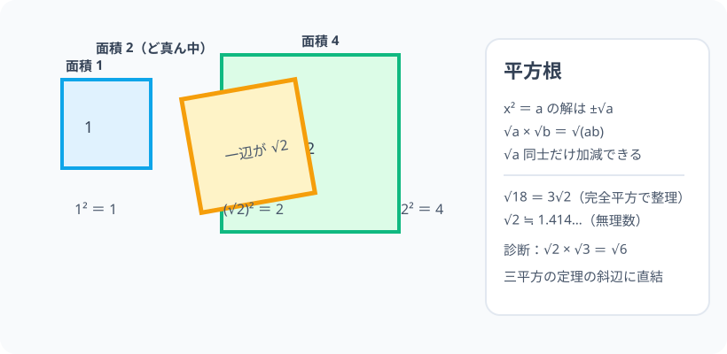

# 平方根：2 乗すると a になる数の「きれいな名前」

> [!abstract] このノードの核心
> $x^2 = a$ の解（$a\ge 0$）は「2 乗して $a$ になる数」=**平方根**。正の方が $\sqrt{a}$、負の方が $-\sqrt{a}$。$\sqrt{2}$ は無限に続く小数（$1.4142…$）で、分数では表せない**無理数**——数の世界がここで一気に広がる。計算は「根号の中の積 ・`√a×√b=√(ab)`」が基本。

> [!success] 合格ライン
> 平方根の定義（正の解・負の解）を言え、$\sqrt{2}\times\sqrt{3}=\sqrt{6}$（＝診断の答え）を証明の言葉で説明できる。$\sqrt{18}=3\sqrt{2}$ など根号の中の整理ができる。$\sqrt{2}$ が分数では表せない予感（無理数）を説明できる。

## 記号の読み方

| 表記 | 読み方 | この教材での意味 |
|---|---|---|
| √a | ルートエー | 2 乗すると a になる正の数 |
| −√a | マイナスルートエー | 2 乗すると a になる負の数 |
| 根号 | こんごう | √ という記号 |
| 無理数 | むりすう | 分数で表せない実数（√2 など） |

> [!tip] √ の読み方
> √a は「ルート・エー」。a ≧ 0 限定。もし a < 0 だと… （後で複素数で再会）。

## 前提ノードと入口判定

機械的な前提関係は、プロジェクト内スナップショット `../ontology/math_euler_complete_ontology.json` を参照し、転記している。外部原本は `G:/マイドライブ/Eleanor Arroway/documents/math_euler_complete_ontology.json`。`trigonometry_master_ontology.md` は人間向けの全体地図として使い、IDや依存関係が異なる場合はJSONを優先する。

| 区分 | ノード・知識 | この教材で必要な理由 | 入口での判定 |
|---|---|---|---|
| 必須ノード（JSON正本） | `JH-ALG-EXPR-01` 文字と式・等式変形 | 式としての扱い（等式を移項・代入） | 2x = 8 を解ける（x = 4） |
| 基礎知識（C類） | 乗法の記法 | 根号計算の前提 | 2 × 3 = 6 を計算できる |

**入口判定の扱い:** JSON の診断問題「√2 × √3 は？」を最初の目安にする。これは計算則（√a×√b＝√(ab)）に当てはまるだけ。**なぜ √6 になるのか**を「(√6)² = 6 で 2 乗関係が維持される」で説明できることが合格ライン。

## 到達点

この教材を閉じたとき、次のことを自分の言葉で説明できる。

- 平方根（x² = a の解）の定義と、√a ・ −√a の 2 つの根。
- √a × √b = √(ab) と、√a/√b = √(a/b) の根拠（2 乗の再現）。
- 根号の中の整理（√18 → 3√2）で「完全平方数を取り出す」。
- √a ± √b の加減ができない（√2+√3 はそのまま）理由。

## 入口：「2 乗して…2 になる数って、どこにいる？」

3 × 3 = 9、4 × 4 = 16。では 2 乗して 2 になる数は？ 1² = 1 と 2² = 4 の間に、うまく隠れている数（1.4142…）。**分数では表しきれない地点**にいる。その数に名前を与えるのが、ルート記号 √ である。

> [!example] 同じ例を最後まで使う
> √2 を主役に置き：定義（一辺 √2 の正方形・面積 2）、√2×√3、有理化の話、√2 の小数（1.414…）を一つの例として一貫して使う。

## 核となる図

図の左：一辺 1 の正方形（面積 1）と一辺 2 の正方形（面積 4）、その間に、「面積 2」の正方形。**その一辺の長さが √2**。名前の由来（平方=正方形・根=元）もここから。

| 図での要素 | 名前 | 役割 |
|---|---|---|
| 一辺 1 | 1² = 1 | 基準の平方 |
| 一辺 2 | 2² = 4 | 一方的な平方 |
| 面積 2 | √2 の平方 | その間にいる（一辺 √2） |

## まずやってみる

> [!question] 式を見る前の10秒
> 面積 2 の正方形の一辺を x とすると、x² = 2。今まで知っている数で言い当てられるか？ 1.4² = 1.96、1.5² = 2.25。1.41²・1.42² と計算していって、x の行き先を予想する。

答えを確認する

1.41² = 1.9881、1.42² = 2.0164。x は 1.414… と続く。**分数では書き切れない「新種の数」**との出会い。

## 平方根の定義

$a \ge 0$ のとき、

$$
x^2 = a \quad の 2 つの解は\quad x = \sqrt{a},\quad x = -\sqrt{a}
$$

$\sqrt{a}$ は「2 乗すると a になる正の数」（正の平方根）、$-\sqrt{a}$ は負の方（負の平方根）。

$$
(\sqrt{a})^2 = a,\qquad \sqrt{a^2} = |a|\quad (a\ \text{が負のとき符号に注意})
$$

$|a|$ 記号（絶対値）は前ノード（NUM-SIGN）で述べた通り「距離」。

## 計算則：積・商の根号

### なぜ √a × √b = √(ab)

$\sqrt{ab}$ を 2 乗すると $ab$。一方、$(\sqrt{a}\times\sqrt{b})^2 = (\sqrt{a})^2(\sqrt{b})^2 = a \cdot b = ab$。**両方とも 2 乗して同じ値**で、正だから等しい（正の 2 乗の値は 1 つ）。

$$
\boxed{\ \sqrt{a}\times\sqrt{b} = \sqrt{ab}\ }
\qquad
\boxed{\ \frac{\sqrt{a}}{\sqrt{b}} = \sqrt{\frac{a}{b}}\ }
$$

### 加減はできない（√2 + √3 = そのまま）

√2 + √3 は「2 とい 3 の平方根の足し算」で、**まとまる理由がない**（2 乗すれば 5+2√6 となり話が変わってしまう）。同類項（√2 同士）だけ整理できる。

## 数値で点検する

### 診断問題：√2 × √3

$$
\sqrt{2}\times\sqrt{3} = \sqrt{2 \times 3} = \sqrt{6}\quad\checkmark
$$

$( \sqrt{6} )^2 = 6$、$(\sqrt{2}\sqrt{3})^2 = 2\times3 = 6$ と検算できる。

### √18 の整理（完全平方数）

$$
\sqrt{18} = \sqrt{9\times2} = \sqrt{9}\times\sqrt{2} = 3\sqrt{2}
$$

$\sqrt{a^2 b} = a\sqrt{b}$（a > 0）。

### √2 の値

$$
\sqrt{2} \approx 1.41421356\cdots
$$

無限小数・循環しない＝**無理数**。この後、三平方の定理や座標・三角関数の計算で何度も使う。

### 極端な場合

- √0 = 0、√1 = 1、√4 = 2。
- √(a²) = |a|：a = −3 で √9 = 3 ✓（−3 は正しくない）。

## 3行まとめ

1. x² = a（a ≧ 0）の解は ±√a。√a は正の方。√a² = a（a ≥ 0）。
2. 積・商は根号をまとめられる（√a √b = √ab、√a/√b = √(a/b)）。
3. 加減は同類（√2 と √2）だけ。√2 は無限小数・無理数、三平方・三角比の未来予備。

## 理解度サポート：どこまで分かっているか

### まず自己評価

- [ ] **0：未学習** — √ の記号にまだ出会っていない
- [ ] **1：見れば分かる** — 定義・計算則の図を追える
- [ ] **2：自力で使える** — 積・商・整理の計算ができる
- [ ] **3：説明できる** — 定義（2 解の話）・無理数・計算則の根拠を説明できる

### 技能ごとの確認問題

| check_id | 確認する技能 | 問い | 答えが曖昧なときに戻る場所 |
|---|---|---|---|
| P0 | JSON指定の入口診断 | √2 × √3 は？ | 「数値で点検する」 |
| C1 | 定義の言い直し | x² = 5 の解は？（答: ±√5） | 「平方根の定義」 |
| C2 | 計算則 | √8 ÷ √2 を計算せよ。（答: 2） | 「計算則」 |
| C3 | 整理 | √50 を a√b の形にせよ。（答: 5√2） | 「√18 の整理」 |
| C4 | 無理数の予感 | √2 が分数で表せない「予感」を説明する。 | 「入口」（小数の続き） |
| C5 | 三平方への橋 | 1×1 の直角三角形の斜辺は？ （答: √2） | 「次のノードへの橋」 |

解答と判定基準を開く

- **P0の答え:** √6（=√(2×3)）。
- **C1の答え:** ±√5（正が √5・負が −√5）。
- **C2の答え:** √(8÷2) = √4 = 2。
- **C3の答え:** √(25×2) = 5√2。
- **C4の答え:** 分数で表せる小数は「有限小数」か「循環小数」のどちらか。1.41421356… はどちらでもない（無限に続き、途中から規則的に繰り返さない）。それこそが無理数の特徴。
- **C5の答え:** √(1²+1²) = √2。三平方の定理（a²+b²=c²）の最初の道。

**判定の目安:**

- P0とC1〜C5を正答かつ理由つきで → 次のノードへ
- C3を誤る → 完全平方（4・9・16・25…）を抜き出す操作を練習
- C4を誤る → 分数との関係（有限・循環小数）を復習

## よくある取り違え

- √2 を「数の 2 と √ に分解したもの」と思う → **√2 は「1 つの数」（数の名前）**。
- √a は「a の 2 乗を から 順に抜く」→ **√(a²) = |a|。a が負だとマイナスが付く**。
- √a + √a = √(2a) と式をまとめる → **√a + √a = 2√a（同類だけ）。√2 + √3 はそのまま**。
- 分数 1/√2 をそのまま放置する（有理化） → **1/√2 = √2/2 と変形（分母に√ を残すのは美でない）**。
- 小数 1.414… を「√2 の近似」でなく「√2 そのもの」と誤解 → **√2 は数そのもの。1.414…は近似値**。

## 自力確認（teach-back）

教材を閉じて、次を声に出して答える。

1. 定義（x² = a の解・正/負の平方根）を語る。
2. √a × √b = √(ab) を 2 乗の関係から証明風に説明する。
3. √18 → 3√2、√50 → 5√2 と整理する。
4. √2 の無理数性と、三平方定理への接続（1×1 → √2）を話す。

## 次のノードへの橋

- **三平方の定理（`JH-GEO-PYTHAGORAS-01`）**：斜辺の長さに √ が主役で出る。
- **2 次方程式（`JH-ALG-QUADRATIC-01`）**：x² = a 型の方程式が平方根そのもの。
- **三角比（`HS1-TRIG-DEF-01`）**：√3/2 など 30°・60° の値の計算の要。

## インタラクティブ化の候補（レビュー後に判定）

- **有効候補: 面積 2 の正方形のブロック（√2 の網掛け）** — 一辺の長さが読み取れる。
- **有効候補: √a×√b の等式チェック** — スライダーで a・b を変えると両側一致。
- **静的なままで十分:** 定義・計算則・値について、静的で十分。
- 動かすことそれ自体を合格条件にはしない。
