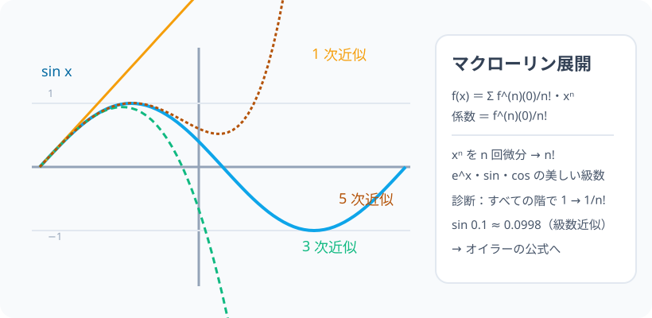

# テイラー展開：どんな関数も、「多項式の無限和」に分解できる

> [!abstract] このノードの核心
> 滑らかな関数は、原点の近くで多項式の無限和（級数）で「なんとでも再現」できる。**マクローリン展開** $f(x) = f(0) + \dfrac{f'(0)}{1!}x + \dfrac{f''(0)}{2!}x^2 + \cdots$。係数は「n 階微分を 0 で評価して n! で割る」。e^x・sin x・cos x の美しい級数は、この式の 1 ステップずつの化身である。

> [!success] 合格ライン
> マクローリン展開の形（Σ f^(n)(0)/n!·x^n）を書き、**係数が 1/n! になる理由**（n 階微分と x^n の相性）を説明できる（＝診断の答え）。sin 0.1 を級数で近似計算できる。

## 記号の読み方

| 表記 | 読み方 | この教材での意味 |
|---|---|---|
| Σ | シグマ | 和（n を 0 から） |
| n! | エヌ階乗 | n(n−1)…1 |
| f^(n)(0) | エフ・エヌじょう・ゼロ | n 階導関数の x=0 での値 |
| 収束半径 | しゅうそくはんけい | 級数が収束する範囲 |

> [!tip] テイラー vs マクローリン
> 展開の中心が 0（原点）なら**マクローリン**、一般の点 a なら**テイラー**。大学で使い分ける。

## 前提ノードと入口判定

機械的な前提関係は、プロジェクト内スナップショット `../ontology/math_euler_complete_ontology.json` を参照し、転記している。外部原本は `G:/マイドライブ/Eleanor Arroway/documents/math_euler_complete_ontology.json`。`trigonometry_master_ontology.md` は人間向けの全体地図として使い、IDや依存関係が異なる場合はJSONを優先する。

| 区分 | ノード・知識 | この教材で必要な理由 | 入口での判定 |
|---|---|---|---|
| 必須ノード（JSON正本） | `HS3-CALC-HIGHER-DIFF-01` 高階導関数 | 係数（f^(n)(0)）の源泉 | sin の 4 周期・e^x 不変を言える |
| 基礎知識（C類） | Σ・階乗 | 級数の表示 | n! と Σ の記法を読み書きできる |

**入口判定の扱い:** JSON の診断問題「e^x の係数 1/n!」を最初の目安にする。**f^(n)(0) = 1（e^x は微分不変）を n! で調整**する、この 2 段を言えれば合格。P0 で確認。

## 到達点

この教材を閉じたとき、次のことを自分の言葉で説明できる。

- マクローリン展開の式（Σ f^(n)(0)/n! x^n）を書ける。
- 係数が f^(n)(0)/n! になる理由（n 階微分との相性）を説明できる。
- e^x・sin・cos のマクローリン展開を書ける。
- sin 0.1 を計算機なしで 2 桁近似できる。

## 入口：「電卓の sin は、実は多項式演算」

電卓の中の sin ボタンは、実は多項式（級数）を計算している。そんな「関数の多項式分解」の最古で最強の方法がテイラー展開だ。関数は「原点の情報（すべての階の微分値）」を持って行くと、そのすべてが係数として並ぶ。

> [!example] 同じ例を最後まで使う
> sin x の展開を主役にし、0.1 の近似・5 章の次への布石で通す。

## 核となる図

図：sin x（青）に、1 次（直線・橙）・3 次（緑）・5 次（茶）の近似多項式が近づいていく様子を重ねて描く。

| 図での要素 | 名前 | 役割 |
|---|---|---|
| 青の波 | y = sin x | 本物 |
| 橙・緑・茶 | 1 次・3 次・5 次近似 | 次数が増えるほど近い |
| 原点の帯 | 収束 | 0 の周りが一致 |

## まずやってみる

> [!question] 式を見る前の10秒
> sin x の f(0)・f'(0)・f''(0)・f'''(0) を並べる（sin(0)=0・cos(0)=1・…）。

答えを確認する

f(0)=0・f'(0)=1・f''(0)=0・f'''(0)=−1 … **4 周期**。係数の“気配”が現れる。

## マクローリン展開

$$
f(x) = f(0) + \frac{f'(0)}{1!}x + \frac{f''(0)}{2!}x^2 + \frac{f'''(0)}{3!}x^3 + \cdots = \sum_{n=0}^{\infty}\frac{f^{(n)}(0)}{n!}\,x^n
$$

### 係数 1/n! の理由（診断 P0）

多項式 $T(x) = c_0 + c_1x + \cdots$ が f と同じ n 階微分を持つように係数を作る。各 n について $T^{(n)}(0) = n!\,c_n$（xⁿ を n 回微分して n!、それ以外は 0）なので

$$
f^{(n)}(0) = n!\,c_n\quad\Rightarrow\quad \boxed{\ c_n = \frac{f^{(n)}(0)}{n!}\ }
$$

**「n 回微分で n! が降りてくる相性」が 1/n! の正体。**

## 代表的な展開

$$
e^x = 1 + x + \frac{x^2}{2!} + \frac{x^3}{3!} + \cdots\qquad\text{（f^(n)(0) = 1 全部・よって 1/n!）}
$$

$$
\sin x = x - \frac{x^3}{3!} + \frac{x^5}{5!} - \cdots,\qquad
\cos x = 1 - \frac{x^2}{2!} + \frac{x^4}{4!} - \cdots
$$

（奇数次・偶数次だけが残る。）

## 数値で点検する

### 診断問題

e^x：どの階の微分も 1（微分不変）→ 係数は（1）/n! = **1/n!** ✓

### sin(0.1) の近似

$$
\sin 0.1 \approx 0.1 - \frac{0.001}{6} + \cdots \approx 0.099833
$$

（電卓 ≈ 0.0998334… と一致。）

### 極端な場合

- 多項式そのもの（x³）なら級数は有限（x³ で止まる）。そのまま。
- 収束半径∞（e^x・sin・cos）と有限（ある関数は制限に注意）。

## 3行まとめ

1. f(x) ≒ Σ f^(n)(0)/n!·xⁿ（原点の情報を全部並べた）。
2. 係数 1/n! は「n 階微分で n! が出る」相性。
3. e^x・sin・cos の有名級数を 1 つの公式から生成できる。

## 理解度サポート：どこまで分かっているか

### まず自己評価

- [ ] **0：未学習** — 級数と聞いたことがあるだけ
- [ ] **1：見れば分かる** — 図・式を追える
- [ ] **2：自力で使える** — e^x・sin・cos の展開を書ける
- [ ] **3：説明できる** — 係数 1/n! の理由・近似の使い方を説明できる

### 技能ごとの確認問題

| check_id | 確認する技能 | 問い | 答えが曖昧なときに戻る場所 |
|---|---|---|---|
| P0 | JSON指定の入口診断 | e^x の係数が 1/n! になる理由は？ | 「係数 1/n! の理由」 |
| C1 | 公式 | マクローリン展開の一般形を書く。 | 「マクローリン展開」 |
| C2 | 計算 | sin x の第 4 項（x⁷ の係数）。（答: 1/7! の符号 −） | 「代表的な展開」 |
| C3 | 近似 | cos 0.1 ≈ ?（答: 約 0.995） | 「数値で点検する」 |
| C4 | 構造 | xⁿ を n 回微分して n! になる理由。 | 「係数 1/n! の理由」 |
| C5 | オイラーの予感 | e^x・cos・sin の級数がどう繋がるか。 | 「次のノードへの橋」 |

解答と判定基準を開く

- **P0の答え:** f^(n)(0) = 1（e^x は微分不変）で、xⁿ を n 回微分すると n! が出るため 1/n!。
- **C1の答え:** 一般形（Σ）。
- **C2の答え:** −1/7!。
- **C3の答え:** 1 − 0.005 + … ≈ 0.995（電卓 ≈ 0.995004）。
- **C4の答え:** xⁿ → n x^(n−1) → … → n(n−1)…1 = n!（0 次まで落ちる）。
- **C5の答え:** e^x の級数を i で分けると…（実部虚部に）——オイラーの公式（次ノード）に直結。

**判定の目安:**

- P0とC1〜C5を正答かつ理由つきで → 次のノードへ
- C4を誤る → n 階微分の手順を（階乗の崩し方を）もう一巡
- C3を誤る → 2 項までの近似と誤差感覚

## よくある取り違え

- 0! を忘れない → **0! = 1（定義）**。
- f^(n)(0) と f(0)ⁿ を混同 → **f^(n)(0) は微分の値（積ではない）**。
- 展開の中心が 0 でないのにマクローリンを使う → **中心 a の場合は (x−a) のべき（テイラー）**。
- 収束を無視して使う → 収束半径の外は別領域（大学で丁寧に）。
- sin の展開ですべての偶数次を忘れる → **奇数だけ（cos が偶数だけ）**。

## 自力確認（teach-back）

教材を閉じて、次を声に出して答える。

1. マクローリン展開の式を書く。
2. 1/n! の理由を「n 回微分」の言葉で。
3. e^x・sin x・cos x の展開（各 4 項）を書く。
4. sin 0.1 を近似 2 桁＝0.0998 の計算を再現する。

## 次のノードへの橋

- **オイラーの公式（`EULER-CONVERGENCE-01`）**：e^x・cos・sin の級数を複素数の世界で統合する。
- **微分方程式・数値解析**：近似多項式の居場所（物理・工学の物差し）。
- Σ 計算（母関数・組み合わせ）の前哨。

## インタラクティブ化の候補（レビュー後に判定）

- **有効候補: 次数 n スライダー（近似のグラフ）** — 1 次→5 次→9 次へ近似が sin に近づく。
- **有効候補: 中心 a のテイラーへの拡張** — 収束の見え方。
- **静的なままで十分:** 図・級数・近似は静的で十分。スライダーは近似の図。
- 動かすことそれ自体を合格条件にはしない。
