# 📘 電車の路線図から大学数学へ
## トロピカル代数とフロンティア法で解き明かす「最短」と「最長」の数理

---

## 🧭 はじめに：日常のインフラから、現代数学の最前線へ

私たちが毎日の通勤や移動で何気なく利用している電車の路線図。スマートフォンで乗り換え案内アプリを開けば、一瞬で「最短ルート」が表示されます。

しかし、その背後にある数理について深く考えたことはあるでしょうか。

> **「なぜコンピュータは、何百万通りものルートから一瞬で『最短時間』を導き出せるのか？」**  
> **「逆に、なぜ『最も遠回りするルート（一筆書き大回り）』を求めようとした途端、スーパーコンピュータですら解けない超難問に化けてしまうのか？」**

実は、この身近な問いの奥には、現代の数学者や情報科学者たちが心血を注いできた**「代数系（半環）」「計算量理論（P vs NP）」「離散構造圧縮（ZDD）」「圏論」**という最高峰の知恵が凝縮されています。

本書は、高度な大学数学の知識を前提としません。  
必要とされるのは、**中学レベルの基本的な算数・数学（足し算、掛け算、不等式）だけ**です。  
また、数学書で初学者がもっとも挫折しやすい**「新しい数式記号の読み方（頭の中でどう音読すればいいか）」をすべて丁寧に補記**しています。

身近な都内の駅（東京・神田・秋葉原・御茶ノ水）を舞台に、自分の手で計算を進めながら、気づけば大学数学・情報数理の深淵を体系的かつ直感的に理解できるよう構成されています。

知的な探究の旅へ、ようこそ。

---

## 🚉 第1章：電車の乗り換えと「総当たり探索」の限界

### 1.1 身近な4駅のネットワークモデル
まずは、東京の中心部で山手線・中央線・総武線が交差する、親しみやすい4つの駅をモデルケースとして考えます。

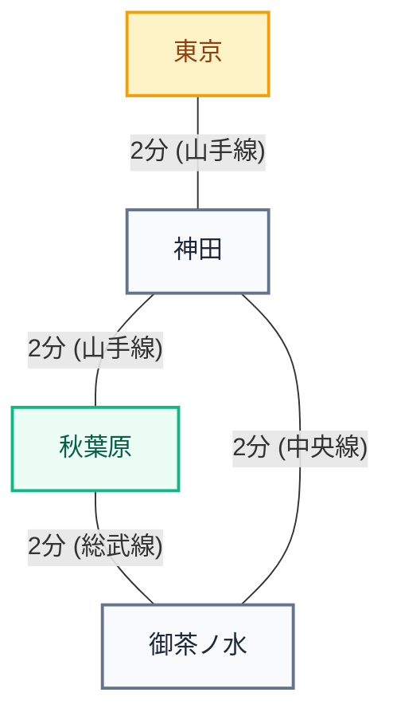

各駅間の所要時間（標準移動時間）は次の通りです：

- **東京 ➔ 神田**: 2分（山手線 / 京浜東北線 / 中央線快速）
- **神田 ➔ 秋葉原**: 2分（山手線 / 京浜東北線）
- **神田 ➔ 御茶ノ水**: 2分（中央線快速）
- **秋葉原 ➔ 御茶ノ水**: 2分（総武線各駅停車）

### 1.2 日常的なアプローチ（総当たり探索）で最短時間を解く
ビジネスや日常生活において、私たちが「東京駅から秋葉原駅までの最短ルート」を求めようとするとき、無意識に行っている思考プロセスを言語化してみましょう。

ここには、**「比較の3要素」**が明確に存在しています：

1. **比較対象（どれとどれを比べるか？）**: 目的地（秋葉原）まで到達する全完了ルート
   - ルートA：東京 ➔ 神田 ➔ 秋葉原
   - ルートB：東京 ➔ 神田 ➔ 御茶ノ水 ➔ 秋葉原
2. **比較方法（どのように比べるか？）**: 全区間の合計所要時間を算出して数値化
   - ルートAの所要時間：$2\text{分} + 2\text{分} = 4\text{分}$
   - ルートBの所要時間：$2\text{分} + 2\text{分} + 2\text{分} = 6\text{分}$
3. **選択の根拠（なぜそれを選ぶか？）**: 最も所要分数が少ないこと
   - $4\text{分} < 6\text{分}$ であるため、**最短時間は「4分（ルートA）」**と結論づける。

これは極めて自然で論理的なアプローチです。情報科学では、このようにすべての選択肢を個別に調べ上げる手法を**「総当たり探索（ブルートフォース・アプローチ）」**と呼びます。

---

### 1.3 ネットワーク拡大に伴う「組み合わせ爆発」
4駅程度の小規模なネットワークであれば、候補ルートは2本しか存在しないため、人間が紙とペンで書き出しても数秒で解決します。

しかし、駅の数が現実のスケールへと拡大したとき、この手法はどのような結末を迎えるでしょうか。

- **10駅程度（山手線の主要駅間）**: 候補ルートは数十〜数百通りに増加。
- **30駅（山手線全線＋中央線）**: ルートの組み合わせは数千〜数万通りに急伸。
- **87駅・200区間（東京都内のJR主要路線網全体）**: ルートの数は天文学的な数字へと跳ね上がります。

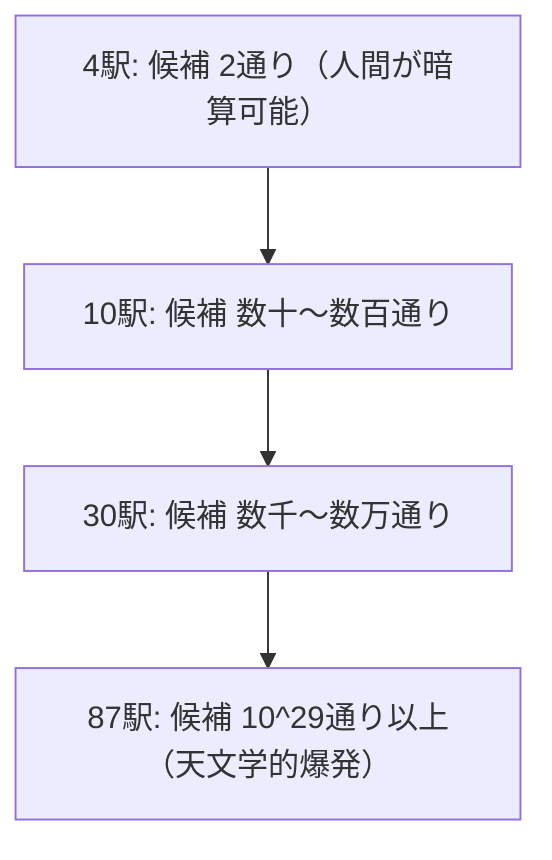

単純なネットワークであっても、選択肢が分岐するたびに乗算的にルートが増加します。東京都内の実路線網において、考えられる経路の組み合わせは実に **$10^{29}$ 通り（1000穣通り）以上**に達します。これは地球上の全砂粒の数や、観測可能な宇宙の星の数に匹敵します。

---

### 1.4 なぜ総当たり探索では破綻するのか
もし、現代の乗り換え案内システムや物流配送最適化エンジンが「すべてのルートを1本ずつ生成し、それぞれ時間を足し算して比較する」という総当たり方式を採用していたらどうなるでしょうか。

1秒間に1兆回計算できる最先端のスーパーコンピュータを用いたとしても、$10^{29}$ 通りを網羅するには**数十億年以上の歳月**を要します。私たちが駅のホームでスマートフォンを操作した瞬間、検索結果が返ってくることは永久にありません。

つまり、**「ルートを1本ずつ書き出して、足し算して、比べる」という従来の発想は、現実規模のネットワークの前では完全に破綻する**のです。

### 1.5 根本的な問い：ルートを探さず、最短値を「代数演算」で一撃特定できないか？
ここで、数学とアルゴリズムの歴史における決定的なパラダイムシフトが起こります。

> **「何億通りものルートを個別に探索するのではなく、  
> まるで方程式を解くように、代数の掛け算を一回行うだけで、  
> 全駅間の最短ルートが自動的に求まるような計算体系は構築できないか？」**

この要請に応える形で現代数学が生み出した画期的な体系が、次章で解説する**「トロピカル代数（Tropical Algebra / Min-Plus代数）」**です。

---

## 🌴 第2章：発想の転換 —「トロピカル代数」という新体系

### 2.1 最短経路問題の本質を見抜く
私たちが最短経路を計算するとき、実際に行っている演算は突き詰めると以下の**2つの操作**に集約されます。

1. 経路を延長するとき：**「所要時間を足し合わせる」**（加算）
2. 複数の経路が合流するとき：**「より短い（小さい）方を選択する」**（最小値選択）

四則演算のうち、「引き算」や「割り算」は一切登場しません。使っているのは「足し算」と「最小値の選択（比較）」の2つだけです。

そこで、20世紀の数学者たちは次のような大胆な発想の転換（ルールの再定義）を行いました。
> **「『最小値の選択』を新しい『足し算』と見なし、  
> 『通常の足し算』を新しい『掛け算』と再定義してしまえばよいのではないか？」**

---

### 2.2 トロピカル半環（Min-Plus代数）の公理と記号の読み方
数学における通常の演算記号「$+$」「$\times$」を、以下のように読み替えます。これを**トロピカル半環（Min-Plus代数：ミン・プラスだいすう）**と呼びます。

| 概念 | 通常の数学 | トロピカル代数 | 定義式 | 意味 |
| :--- | :---: | :---: | :---: | :--- |
| **加算** | $+$ | $\oplus$ | $a \oplus b := \min(a, b)$ | **小さい方を選択する** |
| **乗算** | $\times$ | $\otimes$ | $a \otimes b := a + b$ | **通常の足し算を行う** |

---

> 🗣️ **【記号の読み方ガイド①：$\oplus$ と $\otimes$】**
>
> - **$\oplus$ の読み方**:
>     - 一般名称：**「まるプラス」**、数学では**「直和記号（ちょくわきごう）」**、英語では **plus circle（プラス・サークル）**。
>     - 本書・トロピカル数学での呼び方：**「トロピカル和（トロピカル・プラス）」**。
>     - 読みの例：$a \oplus b$ は「**エイ・プラス・ビー**」または「**エイ・トロピカル・プラス・ビー**」と読みます。
> - **$\otimes$ の読み方**:
>     - 一般名称：**「まるかける」**、数学では**「テンソル積記号（テンソルせききごう）」**、英語では **times circle（タイムズ・サークル）**。
>     - 本書・トロピカル数学での呼び方：**「トロピカル積（トロピカル・タイムズ）」**。
>     - 読みの例：$a \otimes b$ は「**エイ・タイムズ・ビー**」または「**エイ・トロピカル・タイムズ・ビー**」と読みます。
> - **$\min$ の読み方**:
>     - **「ミニマム」**（minimum の略。最小値の意）。
> - **$:=$ の読み方**:
>     - **「コロン・イコール」**（「〜と定義する」という意味の記号）。

---

一見すると奇妙な「あべこべのルール」に見えるかもしれません。しかし、これこそが最短経路の本質をそのまま代数化した姿です。

#### ✏️ 具体的な計算例

- $3 \oplus 7 = \min(3, 7) = \mathbf{3}$  
  （読み：3 トロピカル・プラス 7 は、ミニマム 3, 7 で、答えは **3**）

- $12 \oplus 4 = \min(12, 4) = \mathbf{4}$  
  （読み：12 トロピカル・プラス 4 は、ミニマム 12, 4 で、答えは **4**）

- $3 \otimes 5 = 3 + 5 = \mathbf{8}$  
  （読み：3 トロピカル・タイムズ 5 は、通常の足し算 3 + 5 で、答えは **8**）

- $6 \otimes 0 = 6 + 0 = \mathbf{6}$  
  （読み：6 トロピカル・タイムズ 0 は、通常の足し算 6 + 0 で、答えは **6**）

---

### 2.3 代数系としての美しさ：足し算と同じ「3大計算法則」がそのまま使える奇跡
$\oplus$ を $\min$（最小値の選択）に変えたとき、最も驚くべき本質は**「小学校・中学校で習った『ふつうの足し算・掛け算の計算法則』が、ほぼそのまま寸分違わず使える」**という点にあります。

数学において、ある計算体系が「代数系」として認められるための**3大法則（公理）**が、トロピカルの世界でも完璧に成立しています。

#### ① 交換法則（こうかんほうそく：順番を入れ替えても結果は同じ）
$$ a \oplus b = b \oplus a $$
$$ a \otimes b = b \otimes a $$

> 🗣️ **意味と直感**:  
> 「3分と7分のどちらが早いか」を比べるとき、$\min(3, 7)$ と $\min(7, 3)$ はどちらも **3分** で同じです。移動時間の足し算（$a + b = b + a$）も順序を入れ替えても変わりません。

#### ② 結合法則（けつごうほうそく：どこから先に計算しても結果は同じ）
$$ (a \oplus b) \oplus c = a \oplus (b \oplus c) $$
$$ (a \otimes b) \otimes c = a \otimes (b \otimes c) $$

> 🗣️ **意味と直感**:  
> 3本のルート（例えば 3分、5分、8分）の中から最短を選ぶとき、先に「3分と5分」を比べてから8分と比べても、先に「5分と8分」を比べてから3分と比べても、最終的に選ばれるのは絶対に **3分** です。  
> カッコを気にせず $a \oplus b \oplus c$ と並べて一気に最小値を取ることができます。

#### ③ 分配法則（ぶんぱいほうそく：掛け算を足し算に配ることができる）
$$ a \otimes (b \oplus c) = (a \otimes b) \oplus (a \otimes c) $$

> 🗣️ **式の読み方**:  
> 「エイ・タイムズ（ビー・プラス・シー）イコール（エイ・タイムズ・ビー）プラス（エイ・タイムズ・シー）」

この両辺を「定義通りの意味」に戻して検証してみましょう。

- **左辺**: $a + \min(b, c)$
- **右辺**: $\min(a + b, a + c)$

$a = 10, b = 3, c = 8$ として計算してみます。

- 左辺：$10 + \min(3, 8) = 10 + 3 = \mathbf{13}$
- 右辺：$\min(10 + 3, 10 + 8) = \min(13, 18) = \mathbf{13}$

見事に一致します。  
「2つの候補ルートのうち短い方を選んでから、共通区間10分を加算する」ことと、「両方のルートにそれぞれ10分を加算してから、短い方を選ぶ」ことは、日常の感覚でも完全に同じ結果になりますね。

**足し算と掛け算のルールをあべこべにしたにもかかわらず、交換・結合・分配の3大法則がすべて完璧に成り立っている。**  
だからこそ、私たちは高校や大学で学ぶ「方程式の変形」や「行列の掛け算」の公式を、そのままトロピカルの世界へと持ち込むことができるのです！

---

### 2.4 半環（Semiring）の公理：単位元・零元、そして「べき等性」の魔法

数学では、このような計算法則を備えた体系を**「公理系（Axiom system：こうりけい）」**として厳密に分類します。  
ここでもう一歩踏み込んで、トロピカル空間における「特別な数（元：げん）」の公理を見てみましょう。

#### 1. 加法の単位元（零元 $\varepsilon$：イプシロン）
$a \oplus \varepsilon = a$、すなわち $\min(a, \varepsilon) = a$ を満たす特別な値です。  
いかなる有限の実数 $a$ と比較しても決して選ばれない値、それは **$+\infty$（プラス無限大）** です。
$$ a \oplus (+\infty) = a $$
路線図で言えば、「直通線路がなく行けない区間」の所要時間を $+\infty$ 分にしておけば、最短比較の際に絶対に選ばれずに自然と消えてくれます。

さらに、零元は何を掛けても相手を飲み込む「吸収則（きゅうしゅうそく）」も満たします：
$$ a \otimes \varepsilon = a + (+\infty) = +\infty = \varepsilon $$
（途中の1区間でも線路が途切れていたら、全体の所要時間は $+\infty$（到達不能）になります！）

#### 2. 乗法の単位元（単位元 $e$：イー）
$a \otimes e = a$、すなわち $a + e = a$ を満たす特別な値です。  
加算しても相手の値を変えない数、それは **$0$（ゼロ）** です。
$$ a \otimes 0 = a $$
（移動を伴わずその駅に留まるコストは $0$ 分ですね）

---

> 🗣️ **【記号の読み方ガイド②：$\varepsilon$ と $\infty$】**
>
> - **$\varepsilon$ の読み方**:
>     - **「イプシロン」**（ギリシャ文字 $\epsilon$ の異体字。数学では零元や基準値を表します）。
> - **$\infty$ の読み方**:
>     - **「インフィニティ」** または **「むげんだい（無限大）」**。

---

#### 💡 なぜ「環（かん）」ではなく「半環（はんかん）」と呼ぶのか？
数学好きな読者の方は、「なぜ『トロピカル環』ではなく『トロピカル半環』と呼ぶのだろう？」と疑問に思うかもしれません。

通常の数学（実数や整数）の「環（Ring）」では、足し算に対して**「引き算（逆元：マイナスの数）」**が必ず存在します（$5 + (-5) = 0$）。  
しかし、トロピカル足し算（$\min$）の世界では、**一度小さくなった数をもとの大きな数に戻すような「逆元」が存在しません**（$\min(3, x) = +\infty$ になるような実数 $x$ は存在しないため）。  
逆元（引き算）という「片翼」を持たないため、数学ではこれを半分という意味で**「半環（Semiring：セミリング）」**と呼ぶのです。

#### 🌟 トロピカル特有の切り札：「べき等性（Idempotency）」
しかし、引き算ができない代わりに、トロピカル半環は通常の数学にはない**圧倒的に強力な魔法の公理**を持っています。  
それが**「べき等性（べきとうせい / Idempotency）」**です！

$$ a \oplus a = a $$

> 🗣️ **意味と直感**:  
> ふつうの足し算なら $3 + 3 = 6$ と値がどんどん増えてしまいます。  
> しかしトロピカル足し算では、$\min(3, 3) = \mathbf{3}$ です！  
> **「自分自身に何度自分を足しても、値が絶対に増えない（変わらない）」**のです。

この「べき等性」があるおかげで、電車の路線図を探索するときに、同じルートを重複して足し合わせてしまっても値が狂わず、最短距離が安定してピタッと求まります。  
「ふつうの足し算と同じ法則が使える」と同時に、「自分を足しても増えない」というトロピカルならではの性質が、最短経路問題を解くための最強の武器になっているのです。

---

## 📊 第3章：行列の積による「最短路」の自動算出

### 3.1 そもそも「行列」とは何か？：行と列の覚え方
「行列（Matrix：マトリックス）」と聞くと難しそうですが、実態は私たちが普段見慣れている**「数字をマス目に並べた表（テーブル）」**そのものです。

数学では、数字を縦横に並べて大きな丸カッコ $\begin{pmatrix} \dots \end{pmatrix}$ で囲んで表記します。

ここで、初学者が最も迷いやすいのが**「行（ぎょう）」と「列（れつ）」の区別**です。どちらが横で、どちらが縦だったでしょうか？

```
      第1列  第2列  第3列 （列は「縦」の並び！）
        ↓      ↓      ↓
第1行 → ( 1      2      3 )   ← 「行」は
第2行 → ( 4      5      6 )   ← 「横」の並び！
```

> 💡 **一生忘れない「行と列」の覚え方**:
>
> - **「行（ぎょう）」は【横】**: 漢字の「行」の右払いが**横**へスーッと伸びるイメージ（または「ノートの1行目、2行目」）。
> - **「列（れつ）」は【縦】**: 漢字の「列」の右側の「りっとう（刂）」が**縦**に2本並ぶイメージ（または「前へならえで並ぶ縦列」）。

横に2段、縦に3本並んでいる上の表を、数学では**「2行3列の行列（$2 \times 3$ 行列）」**と呼びます。

---

### 3.2 ふつうの「行列の掛け算（行列積）」はどう計算するのか？

高校や大学で習う「ふつうの行列の掛け算」のルールを、最もシンプルな $2 \times 2$ の行列でコンパクトに確認しておきましょう。

行列の掛け算の合言葉は、ズバリ**「左の横（行） × 右の縦（列）」**です！

```
【左の横（第1行）】        【右の縦（第1列）】           【答え（第1行・第1列）】
  ( a   b )        ×        ( e )          =    ( a×e + b×g )
                              ( g )
「左から右へ進む」  ×  「上から下へ進む」  ➜  ペア同士を掛けて足し合わせる！
```

具体的に数字を入れて計算してみましょう：

$$
\begin{pmatrix}
1 & 2 \\
3 & 4
\end{pmatrix}
\begin{pmatrix}
5 & 6 \\
7 & 8
\end{pmatrix}
=
\begin{pmatrix}
(1 \times 5 + 2 \times 7) & (1 \times 6 + 2 \times 8) \\
(3 \times 5 + 4 \times 7) & (3 \times 6 + 4 \times 8)
\end{pmatrix}
=
\begin{pmatrix}
19 & 22 \\
43 & 50
\end{pmatrix}
$$

- 左上のマス目：左の1行目 $(1, 2)$ と、右の1列目 $(5, 7)$ を掛け合わせて足す ➔ $1 \times 5 + 2 \times 7 = 5 + 14 = \mathbf{19}$
- 右上のマス目：左の1行目 $(1, 2)$ と、右の2列目 $(6, 8)$ を掛け合わせて足す ➔ $1 \times 6 + 2 \times 8 = 6 + 16 = \mathbf{22}$

これが、通常の数学における行列の掛け算です。

---

### 3.3 電車の路線図を行列にする：直通所要時間早見表（隣接行列 $A$）

では、この行列の仕組みを使って、第1章で登場した4つの駅（東京・神田・秋葉原・御茶ノ水）の電車の路線図を表にしてみましょう。  
横（行）を「出発駅」、縦（列）を「到着駅」とします。

ここで極めて重要なのは、**「直通電車がない区間（一度に行けない区間）には、零元である $\infty$（無限大）を記入する」**という点です。

| 出発＼到着 | 東京 (T) | 神田 (K) | 秋葉原 (A) | 御茶ノ水 (O) |
| :---: | :---: | :---: | :---: | :---: |
| **東京 (T)** | $0$ | $2$ | **$\infty$** | **$\infty$** |
| **神田 (K)** | $2$ | $0$ | $2$ | $2$ |
| **秋葉原 (A)** | **$\infty$** | $2$ | $0$ | $2$ |
| **御茶ノ水 (O)** | **$\infty$** | $2$ | $2$ | $0$ |

数学的には、これを**隣接行列 $A$（または $A^1$）**と表記します：
$$
A = \begin{pmatrix}
0 & 2 & \infty & \infty \\
2 & 0 & 2 & 2 \\
\infty & 2 & 0 & 2 \\
\infty & 2 & 2 & 0
\end{pmatrix}
$$

神田からは秋葉原や御茶ノ水へ直通2分で行けますが、**東京から秋葉原、あるいは東京から御茶ノ水へは直通電車がないため、表のマス目は「$\infty$（到達不能）」**になっています。

---

### 3.4 トロピカル行列積：掛け算を「足し算」に、足し算を「min」に変える！

通常の行列の掛け算ルールが分かれば、トロピカル行列の掛け算は**驚くほど簡単**です！

3.2節で見たふつうの行列積のルール：
$$ \text{掛け算（}\times\text{）して、足し算（}+\text{）する} $$
を、第2章で学んだトロピカルのあべこべルールにそのまま置き換えるだけです：
$$ \text{ふつうに足し算（}+\text{）して、小さい方を選ぶ（}\min\text{）！} $$

数式で書くと、こうなります：
$$
(A \otimes A)_{ij} = \bigoplus_{k=1}^N (A_{ik} \otimes A_{kj}) = \min_{1 \le k \le N} (A_{ik} + A_{kj})
$$

---

> 🗣️ **【記号の読み方ガイド③：$\sum$ と $\bigoplus$】**
>
> - **$\sum$ の読み方**:
>     - **「シグマ」**（ギリシャ文字大文字。通常の数学で「全部足し合わせる」という合算命令）。
> - **$\bigoplus$ の読み方**:
>     - **「大型のまるプラス」**、あるいは **「ビッグ・オープラス」**（トロピカル数学で「すべての候補から**最小値（$\min$）を選ぶ**」という命令）。

---

#### 💡 行列積の物理的意味：なぜ「1回掛ける」と「2駅分（2ステップ）」進むのか？
この式の中身である **$A_{ik} + A_{kj}$** に注目してください。

- $A_{ik}$（エイ・アイ・ケイ）: 出発駅 $i$ から中継駅 $k$ への所要時間（**線路1本目**）
- $A_{kj}$（エイ・ケイ・ジェイ）: 中継駅 $k$ から到着駅 $j$ への所要時間（**線路2本目**）
- $A_{ik} + A_{kj}$: **2本の線路をガッチャンコと繋いで足した合計時間！**

つまり、**「行列を1回掛け合わせる（$A \otimes A$）」という代数操作そのものが、「線路を2本連結して2ステップ進む」という物理的な意味そのもの**なのです！

- **$A^1$**: 線路1本分（0回乗り換え・直通）
- **$A^2 = A \otimes A$**: **線路2本分（最大1回乗り換え・2ステップ）**
- **$A^3 = A^2 \otimes A$**: **線路3本分（最大2回乗り換え・3ステップ）**
- **$A^k$**: **線路 $k$ 本分（最大 $k-1$ 回乗り換え・$k$ ステップ）**

---

### 3.5 手計算による検証：$\infty$（行けない）が「最短時間」へと大化けする瞬間！

もし、神田から秋葉原のように「最初から直通2分で行ける区間」を行列積で計算しても、「直通が一番早い」という当たり前の結果が出るだけで、ありがたみは感じられません。

行列の積が真価を発揮するのは、**「直通線路がなく、表の中で $\infty$ になっていた区間」**を計算するときです！

では、**東京から秋葉原へのトロピカル積 $(A \otimes A)_{\text{東京}\to\text{秋葉原}}$** を実際に計算してみましょう。  
直通表 $A^1$ では、東京 ➔ 秋葉原は **$\infty$** でした。  
中継駅 $k$ として、ネットワーク内の全4駅（東京・神田・秋葉原・御茶ノ水）を順に代入してみます。

1. **東京自身を経由（中継なし）**:  
   $A_{\text{東京}\to\text{東京}} + A_{\text{東京}\to\text{秋葉原}} = 0 + \infty = \mathbf{\infty}$

2. **神田を経由（乗り換え）**:  
   $A_{\text{東京}\to\text{神田}} + A_{\text{神田}\to\text{秋葉原}} = 2 + 2 = \mathbf{4\text{分}}$ ⭐

3. **秋葉原自身を経由（直通）**:  
   $A_{\text{東京}\to\text{秋葉原}} + A_{\text{秋葉原}\to\text{秋葉原}} = \infty + 0 = \mathbf{\infty}$

4. **御茶ノ水を経由（別ルート）**:  
   $A_{\text{東京}\to\text{御茶ノ水}} + A_{\text{御茶ノ水}\to\text{秋葉原}} = \infty + 2 = \mathbf{\infty}$

得られた4つの候補値をトロピカル加算（$\min$）します。
$$ (A \otimes A)_{\text{東京}\to\text{秋葉原}} = \min(\infty, \mathbf{4}, \infty, \infty) = \mathbf{4\text{分}} !! $$

……なんということでしょう！  
**直通表では「$\infty$（到達不能）」だったマス目が、行列をたった1回掛け算しただけで、神田という最適な中継駅を自動的に発見し、「4分」という最短時間に鮮やかに生まれ変わったのです！**

同様に、直通がなかった「東京 ➔ 御茶ノ水」も、神田を経由することで $2 + 2 = \mathbf{4\text{分}}$ と計算され、$\infty$ が消滅します。

---

### 3.6 累乗の伝播：駅全体へ最短距離が染み渡るメカニズム
行列の掛け算をさらに繰り返すと、何が起きるでしょうか。

- **$A^1$（直通表）**: 1区間のみ。直通がないマスはすべて $\infty$。
- **$A^2 = A \otimes A$**: **最大2区間（1回乗り換えまで）** を使って行ける全ペアの最短時間が確定（東京➔秋葉原、東京➔御茶ノ水が開通！）。
- **$A^3 = A^2 \otimes A$**: **最大3区間（2回乗り換えまで）** を使って行ける最短時間が確定。
- $\dots$
- **$A^{N-1}$**: **全 $N$ 駅間の究極の最短時間行列（閉包行列 $A^*$：エイ・スター）が完成！**

---

> 🗣️ **【記号の読み方ガイド④：$A^*$ と $O(N^3)$】**
>
> - **$A^*$ の読み方**:
>     - **「エイ・スター」**（数学・情報科学におけるクリーネ閉包記号。ここではすべての駅間の最短距離が出揃った最終結果の行列を指します）。
> - **$O(N^3)$ の読み方**:
>     - **「オーダー・エヌの3乗（さんじょう）」** または **「ビッグ・オー・エヌ・キューブ」**。
>     - 意味：駅の数 $N$ が2倍になると計算の手間がおよそ $2^3 = 8$ 倍になるという、計算量の規模を表すランダウの記号です。多項式の範囲で収まるため、コンピュータにとって「極めて容易に解ける問題（クラスP）」であることを示します。

---

全駅数が $N$ のネットワークにおいて、どんなに遠回りな最短ルートであっても、最大で $N-1$ 回電車に乗ればすべての駅に行き着きます。  
したがって、行列の累乗を $N-1$ 回繰り返すだけで、池に投げた小石の波紋が広がるように、全駅間の最短所要時間が自動的にすべて求まります。

---

### 3.7 なぜわざわざ行列を使うのか？ — 4駅から87駅、そして現実の巨大インフラへ

ここで、読者のみなさんはこう思われたかもしれません。  
> **「でも、たった4駅なら、地図を見れば神田を通れば4分で行けることくらい暗算ですぐわかるよ。わざわざこんな大げさな行列の掛け算をする意味があるの？」**

その通りです！たった4駅、路線が数本しかないミニマムモデルであれば、人間が目で見て直感で解いた方が圧倒的に早いです。

**しかし、現実の世界を想像してみてください。**

都内のJRや地下鉄のように、**駅が30駅、87駅、数百駅と広がり、山手線、中央線、総武線、京浜東北線、丸ノ内線、千代田線、東西線……と何十もの路線が網の目のように複雑怪奇に交差している巨大ネットワーク**ではどうなるでしょうか？

- 「どの駅で乗り換えるのが本当に一番早いのか？」
- 「一見遠回りに見えても、快速電車や別の地下鉄を2回乗り換えた方が早いのではないか？」
- 候補となる乗り継ぎルートは何万、何千万通りと入り組み、**人間の直感や目視では絶対に正解を追いきれません**。

**ここで、トロピカル行列積が圧倒的な真価を発揮します！**

コンピュータには、人間のような「直感」も「地図を眺めて悩む目」もありません。  
しかし、コンピュータに迷路の探索をさせる代わりに、**「ただの表の掛け算（トロピカル行列積）を淡々と数回繰り返せ」**と命令するだけで：

- 87駅ネットワークであれば、全ペア **$87 \times 87 = 7,569$ 通りすべての最短時間と乗り換えルート**が、
- 人間の勘や見落としに一切頼ることなく、
- **漏れなく、重複なく、わずか 0.002 秒で完全に求まってしまう**のです！

これこそが、私たちが**「わざわざトロピカル代数を使い、行列の積として最短経路を解く」真の必然性**です。  
人間の認知の限界を、冷徹で美しい機械的な代数演算によって一撃で突破する――これぞ現代情報社会を支える数学の真髄なのです。

---

### 3.8 半環スロットの魔法：新しい行列（表）を作るだけで「最短距離」も「最安運賃」も同じ計算で解ける！

トロピカル行列積を使うメリットは、計算の圧倒的な速さだけではありません。  
実は、現代数学において物事を「半環（代数系）」として抽象化する**最大のメリット**は、**「中身の数字（コストのスロット）を差し替えた新しい行列（表）を作るだけで、全く同じ計算ロジックがそのまま使い回せる」**という驚異的な汎用性にあります。

具体的に「差し替える」とはどういうことでしょうか？  
難しいアルゴリズムを書き直す必要は一切ありません。**ただ、最初に用意する「早見表（行列）」を、目的の単位に合わせて新しく1つ作るだけ**です。

- **所要時間（分）の表（時間行列 $A_{\text{時間}}$）を作る**  
  ➔ まったく同じ行列積を計算するだけで、自動的に **「最短時間ルート」** が求まる！

- **営業キロ（km）の表（距離行列 $A_{\text{距離}}$）を新しく作る**  
  ➔ 計算式やプログラムを1文字も変えずに、そのまま掛け算するだけで **「最短距離ルート」** が求まる！

- **運賃（円）の表（運賃行列 $A_{\text{運賃}}$）を新しく作る**  
  ➔ まったく同じ代数計算で、**「最安運賃ルート」** が求まる！

もし、手続き型の従来の迷路探索プログラム（ダイクストラ法など）でこれを実現しようとすると、「時間優先」から「距離優先」「運賃優先」へと切り替えるたびに、プログラム内部の条件分岐や優先度判定ロジックを細かく書き換える必要があります。

しかし、トロピカル半環という「代数の器（スロット）」に乗せてしまえば、**「解きたい目的に応じた新しい表（行列）を1つ作って放り込むだけ」で、全く同じ行列の掛け算（$A \otimes A$）がすべてを解決してくれる**のです。

---

#### ⚠️ なんでも差し替えOKではない！：スロットに適合する「2つの絶対条件」
では、世の中のどんなデータでもこの表に放り込めば最短（最適）が求まるのでしょうか？  
**もちろん、何でもよいわけではありません。**

このトロピカル半環スロットに差し替えて正しく計算が成立するためには、その数字（コスト）が**以下の2つの性格（性質）**を必ず持っていなければなりません。

1. **「加法性（かほうせい）」：区間を繋いだら、ただの足し算で合計できること**  
   - 第3章で見た通り、行列積の基本は「$A_{ik} + A_{kj}$（1本目 ＋ 2本目）」でした。  
   - 「時間」や「距離」は、2区間進めば単に足し算（$2\text{分} + 2\text{分} = 4\text{分}$）になります。だから適合します。  
   - **❌ ダメな例（平均速度や混雑率）**：  
     「区間1の平均時速が 60km/h、区間2が 40km/h」だからといって、2区間の合計が「時速 100km/h」にはなりませんね。このように**「区間を繋げても単純な足し算にならないもの」は、トロピカル行列積のスロットには入れられません**。

2. **「非負性（ひふせい）」：進めば進むほど値が 0 以上増えること（マイナスにならない）**  
   - 時間も距離も、電車が1駅進めば必ず $0$ 以上のコストがかかります（進むほど時間は増える）。  
   - **❌ ダメな例（無限キャッシュバックや乗れば乗るほど若返るタイムマシン）**：  
     もし「この路線に乗ると運賃がマイナス500円もらえる（負のコスト）」という区間があると、そこをぐるぐる回るだけでコストが $-\infty$ に吸い込まれ、最短計算が破綻してしまいます（次章で見る無限ループの罠です）。

> 💡 **まとめ**:  
> **「進むほど増え（非負性）、繋いだら単純に足せる（加法性）数字」**であれば、時間・距離・運賃・電力消費量・CO2排出量など、どんな指標でも**新しい表を作るだけでまったく同じトロピカル行列積で一発解決できる**のです！

この「一度作った代数計算の器に、新しく作った表を差し込むだけで何でも再利用できる」という美しさと柔軟性こそが、数学が持つ抽象化の真の力なのです。

---

## 🌀 第4章：最長経路探索の罠と無限ループの発生

### 4.1 乗り鉄のロマン「一筆書き大回り乗車」
最短経路がこれほど鮮やかに解決されるのを目の当たりにすると、私たちは自然と次なる問いへと進みたくなるものです。

> **「最短が代数で解けたのなら、最も遠回りする『最長経路』も同様に解けるのではないか？」**

鉄道ファンに広く知られる「大回り乗車」は、JR旅客営業規則第157条第2項（大都市近郊区間内相互発着の特例）に基づき、**「同一駅を2度通過しない限り、どれほど遠回りしても最短区間の運賃で乗車できる」**という合法的な乗り方です。  
例えば「東京から神田（1駅・150円）」の切符で、房総半島や北関東を一周して数十時間・数百キロを旅するようなルートです。

---

> 💡 **【超重要コラム：パズルの「一筆書き」と、JRの「一筆書き」の決定的な違い！】**
> 
> ここで、読者のみなさんが最も勘違いしやすい**「一筆書きという言葉の落とし穴」**について、あらかじめ明確にしておきましょう。  
> 私たちが日常で使う「一筆書き」には、数学的に**まったく異なる2つの種類**が存在します。
> 
> | 種類 | ルール | 数学での正式名称 | 身近な例 |
> | :--- | :--- | :--- | :--- |
> | **① 線の重複禁止（ふつうの一筆書き）** | **「同じ『線』を2度なぞってはいけない」**<br>（※交差点は何度交差して通ってもセーフ！） | **オイラー路**<br>（Eulerian Path） | 子供の「星型（☆）」パズル、封筒型の家パズル |
> | **② 駅の重複禁止（JRの大回り乗車）** | **「同じ『駅（交差点）』に2度入ってはいけない」**<br>（※線が違っても、同じ駅に再訪したら即アウト！） | **単純パス**<br>（自己回避歩道 / ハミルトン路） | **JR大回り乗車**、巡回セールスマン問題 |
> 
> #### ❌ なぜ①（線の重複禁止）ではダメなのか？
> もし「通る線路さえ違えば、同じ駅に何度戻ってきても良い（①）」としてしまうと、  
>
> - 「東京 ➔ 神田 ➔ 秋葉原 ➔ 御茶ノ水 ➔ **神田（2回目！）** ➔ 新宿 ➔ 渋谷 ➔ 品川 ➔ **神田（3回目！）**……」  
> と、神田駅を中心にして花びらのように何度も同じ駅に戻ってくる無限ループが可能になってしまいます。
> 
> しかし、JRの公式ルール（旅客営業規則第157条）は**「同一駅の通過は人生でたった1度きり」**と厳格に定めています。  
> したがって、この教材で解くべきルールは**「② 駅の重複禁止（単純パス）」**です！
> 
> これにより、どの駅を通過するときも、
>
> - **「入ってくる線路（1本目）」＋「出ていく線路（2本目）」＝ 合計2本まで！**
> - **3本目の線路を使うことは絶対にできない（2回目の訪問になるため反則！）**  
> 
> という、極めて美しく厳格な制約が生まれるのです。

---

### 4.2 Max-Plus半環の適用と無限ループ
「最短が $\min$ なのだから、最長を求めるには $\min$ を **$\max$（マキシマム：最大値選択）** に置き換えればよい」と考えるのは自然です。  
加算を $\max$、乗算を $+$ とする体系は**「Max-Plus半環（マックス・プラスはんかん）」**と呼ばれます。

しかし、これを山手線のような環状線（閉路）を含む路線網に適用すると、深刻な数理的破綻が生じます。

東京から神田への最長所要時間を計算してみましょう。

1. 東京 ➔ 神田（直通：2分）
2. 東京 ➔ 品川 ➔ 渋谷 ➔ 新宿 ➔ 上野 ➔ 神田（山手線1周：約60分）
3. 山手線をさらにもう1周してから神田へ（約120分）
4. 山手線を10周してから神田へ（約600分）
5. $\dots$

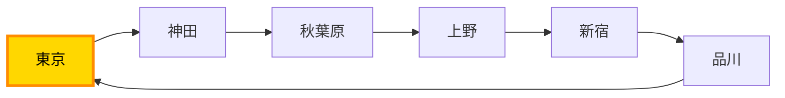

ネットワーク内に1つでも正のコストを持つループが存在する場合、Max-Plus行列の累乗は周回を無限に繰り返すことでコストをいくらでも増大させられます。その結果、**行列の成分は $+\infty$ に発散し、計算は永久に収束しません**。

---

### 4.3 「一筆書き制約」の代償：NP困難の壁
この無限ループを排除するための不可欠な条件こそが、**「同一の駅を2度通ってはならない（単純パス制約／一筆書き）」**というルールです。

しかし、この一見シンプルに見える制約を追加した瞬間、問題の性質は劇的に変貌します。

- **最短経路（マルコフ性：マルコフせい）**:  
  現在いる駅の情報のみに依存。「過去にどのような経路を辿って神田駅に来たか」は未来の最短判断に一切影響しません。

- **一筆書き最長経路（非マルコフ性：ひマルコフせい）**:  
  「過去に訪問したすべての駅の履歴」に未来の選択肢が依存。「すでに上野駅を通過したか否か」によって、次に進める線路が決定的に制限されます。

過去の全履歴を状態として保持しなければならないため、計算量は駅数の増加に伴い指数関数的に爆発します。  
これこそが、現代計算機科学において最も解決困難とされる**「NP困難（エヌピーこんなん / NP-hard）」**の領域です。

都内JR98区間における単純パスの全通り数は **$2^{98} \approx 6.3 \times 10^{29}$ 通り**。  
最新鋭のスーパーコンピュータを用いても、全パターンの個別探索は物理的に不可能です。

---

## 🌲 第5章：境界線の魔法 — 湊真一教授のZDDフロンティア法

### 5.1 組み合わせ爆発を制圧する日本発のイノベーション
グラフの中から特定の条件を満たす経路や部分構造（一筆書きルート、最小全域木、独立点集合など）を探し出そうとするとき、私たちは常に**「組み合わせ爆発」**という巨大な壁に直面します。

エッジ（辺）の総数を $M$ 本とすると、エッジを選ぶか選ばないかの組み合わせは全体で **$2^M$ 通り** に達します。
エッジが30本あれば $2^{30} \approx 10^9$（10億通り）、100本あれば $2^{100} \approx 1.27 \times 10^{30}$ 通りという、宇宙の原子数にも匹敵する天文学的数字へと跳ね上がります。
全国の交通網、大規模集積回路（VLSI）の配線、電力網、通信ネットワークなど、数千〜数万のノードを持つ実世界のシステムにおいて、すべての組み合わせを個別にあたりつくすことは現代のスーパーコンピュータをもってしても物理的に不可能です。

この計算限界に対して、世界的なブレークスルーをもたらしたのが**湊真一教授**（北海道大学・京都大学名誉教授）です。

湊教授が開発した**「ZDD（Zero-suppressed Binary Decision Diagram / ゼロサプレス型二分決定グラフ）」**と、それをグラフ探索に応用した**「フロンティア法（Frontier-based Search / Simpath）」**は、離散アルゴリズムと計算機科学の常識を根底から覆しました。

---

> 🗣️ **【用語の読み方ガイド⑤：ZDD と DAG】**
>
> - **ZDD の読み方と正式名称**:
>     - **「ゼット・ディー・ディー」**
>     - 正式名称：**Zero-suppressed Binary Decision Diagram（ゼロサプレス型二分決定グラフ：ゼロサプレスがた にぶんけっていグラフ）**。
>     - 「ゼロサプレス（不要なゼロの枝を自動的に削除・抑制する）」という意味を持つ、疎（スパース）な離散構造の超圧縮データ構造です。
> - **DAG の読み方と正式名称**:
>     - **「ダグ」**（または「ディー・エー・ジー」）。
>     - 正式名称：**Directed Acyclic Graph（有向非巡回グラフ：ゆうこう ひじゅんかい グラフ / 有向非輪胴グラフ）**。
>     - 内部に循環（閉路・ループ）が一切なく、矢印の方向に沿って過去から未来へと一方向にのみ進むグラフを指します。

---

### 5.2 コペルニクス的転回：迷路を走るな、ベルトコンベアに並べろ！

従来の探索アルゴリズム（深さ優先探索 DFS や幅優先探索 BFS）とフロンティア法の最大の違いは、**「問題をどの視点から眺めているか」**にあります。

一筆書きルートを探すとき、多くの人は無意識に「スタート地点に立ち、自分がコマ（電車）になって迷路の中を歩き回る」というアプローチをとります。
しかし、この**「迷路走り方式」**こそが、組み合わせ爆発を引き起こす根本原因です。
分岐に出くわすたびに「過去にどこを通ってきたか」という歩行履歴を丸ごと抱え込まなければならず、探索木（サーチツリー）は無限に枝分かれしてメモリを食い尽くします。

フロンティア法は、この探索の常識を180度転換しました。

> 🌟 **【フロンティア法の真髄：コペルニクス的転回】**
>
> **「迷路を走るのをやめ、すべてのエッジ（線路）を1列のベルトコンベアに並べる。  
> そして、エッジの本数の回数（たった $M$ 回！）だけベルトコンベアを進めながら、  
> そのエッジの両端のノードカルテに対して『数個の安全チェック』をするだけで、  
> 可能性の残ったすべての有効ルートが完全に特定されてしまう！」**

<div class="compare-grid">
  <div class="compare-card danger">
    <div class="compare-card-title">🚶‍♂️ 【従来の探索】迷路走り方式（歩行者目線）</div>
    <ul>
      <li>自分が迷路の中に入り、道順を1歩ずつ進む。</li>
      <li>分岐のたびに「過去の全道順」を記憶しなければならない。</li>
      <li>探索の枝分かれが指数関数的に爆発し、メモリが尽きて破綻する。</li>
    </ul>
  </div>
  <div class="compare-card success">
    <div class="compare-card-title">🏭 【フロンティア法】ベルトコンベア方式（工場長目線）</div>
    <ul>
      <li>迷路の中には1歩も足を踏み入れない！</li>
      <li>グラフの全エッジをあらかじめ1列に固定して並べる。</li>
      <li>上から1本ずつ「採用(1)／不採用(0)」の二者択一を機械的に審査する。</li>
      <li>調べるステップ数は「エッジの総本数（$M$回）」で完全に確定する！</li>
    </ul>
  </div>
</div>

どんなに入り組んだ巨大ネットワークであっても、エッジの総数が $M$ 本であれば、アルゴリズムは**正確に $M$ ステップで完了**します。
この「迷路を走らず、エッジを固定順で一列スキャンする」という発想の転換こそが、フロンティア法の第一の柱です。

---

### 5.3 「フロンティア（境界線）」の数学的本質：なぜ過去を捨てられるのか？

「エッジを順番に審査するだけで、なぜ道迷いを防げるのか？ なぜ過去の足跡を忘れても良いのか？」  
その数学的な秘密が、本手法の名前にもなっている**「フロンティア（境界線 / 前線）」**という概念です。

#### ✂️ エッジの切断（Cut）とフロンティアの厳密な定義
グラフ $G=(V, E)$ の全エッジを $e_1, e_2, \dots, e_M$ という固定順序で並べたとします。  
いま、ステップ $i$（エッジ $e_i$ まで審査を終えた瞬間）を考えると、グラフのエッジ集合 $E$ は次の2つにスパッと切断（分断）されています。

1. **【過去の世界（既処理エッジ集合 $E_{past}$）】**: すでに採用／不採用を決定したエッジたち $\{e_1, \dots, e_i\}$
2. **【未来の世界（未処理エッジ集合 $E_{future}$）】**: まだ審査していない、これから決定するエッジたち $\{e_{i+1}, \dots, e_M\}$

このとき、グラフ上の全ノード（頂点）は、次の**3つの運命**のいずれかに分類されます。

<div class="svg-diagram-wrapper">
  <svg viewBox="0 0 680 300" class="svg-cut-diagram" xmlns="http://www.w3.org/2000/svg">
    <!-- 背景領域：過去の世界 -->
    <rect x="10" y="10" width="320" height="280" rx="10" fill="#f8fafc" stroke="#cbd5e1" stroke-width="1.5" />
    <text x="170" y="38" font-size="15" font-weight="bold" fill="#334155" text-anchor="middle">【過去の世界】（既処理エッジ）</text>

    <!-- 背景領域：未来の世界 -->
    <rect x="350" y="10" width="320" height="280" rx="10" fill="#f0f9ff" stroke="#bae6fd" stroke-width="1.5" />
    <text x="510" y="38" font-size="15" font-weight="bold" fill="#0369a1" text-anchor="middle">【未来の世界】（未処理エッジ）</text>

    <!-- 中央のフロンティア（切断・境界線） -->
    <line x1="340" y1="15" x2="340" y2="285" stroke="#ef4444" stroke-width="3" stroke-dasharray="6 5" />
    <rect x="260" y="250" width="160" height="28" rx="6" fill="#ef4444" />
    <text x="340" y="269" font-size="12" font-weight="bold" fill="#ffffff" text-anchor="middle">フロンティア（境界線・切断）</text>

    <!-- エッジ（接続線） -->
    <line x1="120" y1="90" x2="220" y2="150" stroke="#64748b" stroke-width="2.5" />
    <line x1="120" y1="90" x2="50" y2="90" stroke="#94a3b8" stroke-width="2" stroke-dasharray="4 3" />
    <!-- 境界をまたぐエッジ -->
    <line x1="220" y1="150" x2="460" y2="150" stroke="#0284c7" stroke-width="3.5" />
    <!-- 未来エッジ -->
    <line x1="460" y1="150" x2="560" y2="210" stroke="#64748b" stroke-width="2.5" />
    <line x1="560" y1="210" x2="630" y2="210" stroke="#94a3b8" stroke-width="2" stroke-dasharray="4 3" />

    <!-- ノード -->
    <!-- ① 完全な過去ノード -->
    <circle cx="120" cy="90" r="14" fill="#64748b" stroke="#ffffff" stroke-width="2.5" />
    <text x="120" y="65" font-size="13" font-weight="bold" fill="#475569" text-anchor="middle">① 過去ノード</text>
    <text x="120" y="118" font-size="11" fill="#64748b" text-anchor="middle">（忘却・消去OK）</text>

    <!-- ② フロンティアノード（左） -->
    <circle cx="220" cy="150" r="16" fill="#f59e0b" stroke="#ffffff" stroke-width="3" />
    <text x="220" y="125" font-size="13" font-weight="bold" fill="#b45309" text-anchor="middle">② 境界ノード</text>
    <text x="220" y="184" font-size="11" font-weight="bold" fill="#d97706" text-anchor="middle">【カルテ記憶】</text>

    <!-- ② フロンティアノード（右） -->
    <circle cx="460" cy="150" r="16" fill="#f59e0b" stroke="#ffffff" stroke-width="3" />
    <text x="460" y="125" font-size="13" font-weight="bold" fill="#b45309" text-anchor="middle">② 境界ノード</text>
    <text x="460" y="184" font-size="11" font-weight="bold" fill="#d97706" text-anchor="middle">【カルテ記憶】</text>

    <!-- ③ 完全な未来ノード -->
    <circle cx="560" cy="210" r="14" fill="#0284c7" stroke="#ffffff" stroke-width="2.5" />
    <text x="560" y="185" font-size="13" font-weight="bold" fill="#0369a1" text-anchor="middle">③ 未来ノード</text>
    <text x="560" y="238" font-size="11" fill="#0284c7" text-anchor="middle">（まだ見なくてOK）</text>

    <!-- 中央の架け橋ラベル -->
    <rect x="290" y="136" width="100" height="26" rx="4" fill="#ffffff" stroke="#0284c7" stroke-width="1.5" />
    <text x="340" y="153" font-size="11" font-weight="bold" fill="#0284c7" text-anchor="middle">架け橋エッジ</text>
  </svg>
</div>

1. **完全な過去ノード**: すでに接続するすべてのエッジの審査が終わり、未来の世界にはエッジが1本も残っていないノード。
2. **フロンティア・ノード（境界ノード $F_i$）**: **過去のエッジにも接続し、かつ未来のエッジにも接続しているノード！**
3. **完全な未来ノード**: まだ1本もエッジが審査に登場していないノード。

#### 💡 なぜ「過去の全履歴（GPS日記）」が不要なのか？
ここで、アルゴリズムの成否を分ける本質的な問いが生まれます。  
**「これから未来のエッジを繋ぐかどうかを判断するとき、過去の世界について何を知っていれば十分か？」**

答えは極めて明快です。  
**「過去の世界と未来の世界を繋ぐ架け橋は、境界線上に露出している【フロンティア・ノード】以外に存在しない！」**

たとえ過去の世界の中でどれほど複雑にくねくねと100本の線路が敷かれていようと、未来の世界から見れば、過去の細かな道順など1ミリも関係ありません。  
未来の選択肢に影響を与えるのは、**「境界線の上にいるノード同士が、背後（過去の世界）でどう繋がっているか」という接続状態だけ**です！

したがって、過去の膨大な歩行順序や詳細なルート履歴（GPSログ）は、**すべて完全に消去して捨ててしまって構いません**。  
手元に残すべきデータは、**「現在フロンティア上にいるノードの極小カルテ」**だけなのです！

#### 🧹 完全な過去ノードの「忘却（メモリ解放）」
さらに美しいのが、役目を終えたノードの**「完全忘却」**です。

あるノードに接続する最後のエッジの審査が終わると、そのノードはフロンティアから外れて「完全な過去ノード」へと移ります。  
その時点でそのノードが目標（端点なら1本、通過点なら2本または0本）を正しく達成していれば、**そのノードのカルテは手元から跡形もなく消去（忘却）**されます。未来の世界でそのノードが参照されることは二度とないからです。

この「フロンティア上のノードだけを覚え、通過したノードは即座に忘却する」という性質により、手元に保持すべきノード数は常に**「フロンティア幅（境界線が横切るノード数 $|F_i|$）」**に制限されます。  
グラフ全体が何万ノードあろうとも、境界線の幅さえ狭ければ、メモリ消費量は驚くほど小さく抑え込まれるのです。

---

### 5.4 状態の極小カルテ表現：「接続次数」と「相棒（Mate）」

「フロンティア上の接続状態を記録する」と言っても、コンピュータの手元では具体的にどのようなデータを管理しているのでしょうか？

フロンティア法において、各ノードに記録されるデータは**たった2つの数値・識別子だけ**です。

| ノード識別子 | ① 接続次数（Degree: 0〜2） | ② 相棒（Mate: 連結成分の反対側の端点） |
| :---: | :---: | :---: |
| **ノード $u$** | **1本** | **ノード $v$** |
| **ノード $v$** | **1本** | **ノード $u$** |

1. **接続次数（Degree）**: そのノードに現在何本のエッジが接続されたか（0本／1本／2本）。
2. **相棒（Mate）**: そのノードから伸びる一本道の「反対側の端っこにいるノード」は誰か。

#### 💡 「相棒（Mate）」という天才的アイデア
なぜ相棒を記録するだけで、途中の複雑な経路をすべて復元・管理できるのでしょうか？

一本の単純なパス（一筆書きの道）を考えたとき、道がどれほど長く伸びていようと、**「新しくエッジを繋ぎ足して道を伸ばせる場所」は、そのパスの両端（2つの端点）しか存在しません**。  
途中のノードはすでに「入る＋出る＝2本」で埋まっており、これ以上エッジを繋ぐことは許されないからです。

したがって、端点ノード $u$ にとって重要なのは「自分の反対側の端点は $v$ である」という情報（$Mate(u) = v$）だけです。  
途中にどんなノードが挟まっていようと、カルテには $u$ と $v$ のお互いへのポインタ（相棒）を書いておくだけで、一本道としての連結関係が完璧に維持されます！

---

### 5.5 1ステップの動的サイクルと「3大安全チェック」

ベルトコンベアが1コマ進み、1本のエッジ $e = (u, v)$ が流れてきたとき、アルゴリズムは各ステップで次の**3段階の動的サイクル**を機械的に実行します。

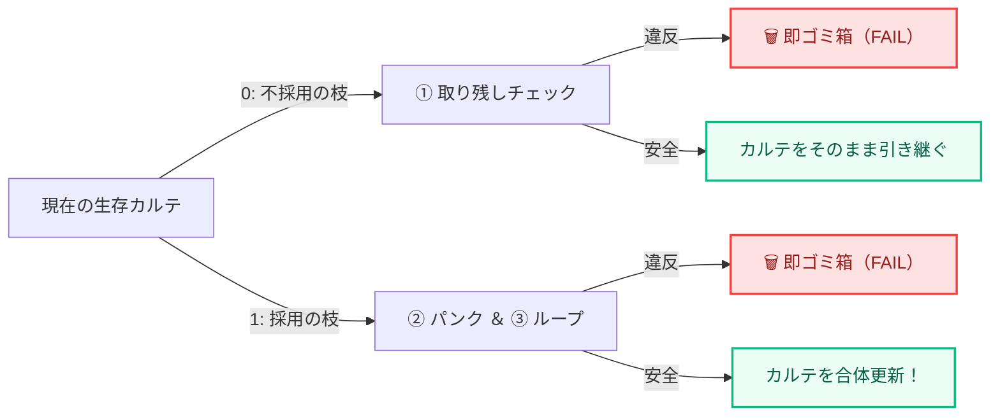

1. **仮カルテの二股分岐**:  
   現在生き残っている各カルテに対して、エッジ $e$ を「使わない（0）」場合と「使う（1）」場合の2つの仮カルテを一瞬だけ生成します。
2. **超局所的な安全審査**:  
   グラフ全体を探索する必要は一切ありません！ 調べるのは**「いま注目しているエッジの両端にある2つのノード $u$ と $v$ のカルテ」だけ**です。
3. **違反枝の即時破棄（メモリに残さずFAILへ直行！）**:  
   ルール違反を起こした仮カルテは、**メモリに1バイトも残さず、その瞬間にゴミ箱（FAIL終端）へ捨てて消滅**させます。合格した健全なカルテだけが手元に残り、次のエッジの審査へ進みます。

#### 🛡️ あらゆるグラフに共通する「3大安全チェック判定ルール」
エッジ $e = (u, v)$ を審査するとき、コンピュータは次の3つのルールで機械的に合否を判定します。

> 🎯 **【普遍的な合格条件（単純パス・一筆書きの場合）】**
> - **始点（スタート）／終点（ゴール）**: 最終目標として必ず「接続次数 1」で終了すること！
> - **その他のすべての通過ノード**: 最終目標として「接続次数 2（通過）」または「接続次数 0（不使用）」で終了すること！

##### 🛡️ ① 取り残しチェック（孤立・遭難の防止）—「使わない（0）」ときの審査
エッジを不採用にするとき、両端のノード $u, v$ が**「行き止まりで遭難しないか」**をチェックします。

- もし、いま不採用にしようとしているエッジ $e$ が、ノード $u$ にとって**「未来に残された最後の接続チャンス（最後の未処理エッジ）」**だった場合：
  - その時点で始点・終点が「次数0」のまま、あるいは通過ノードが「次数1（入ったきり出られない）」のままであれば、そのノードは未来永劫、合格条件を達成できなくなります！
  - ➔ **最後のチャンスを捨てて目標未達となるカルテは即座に違反！ ゴミ箱（FAIL）へ破棄！**
  - （※まだ未来に別のエッジが残っているノードなら今回はスルーしても安全なため、合格として次へ引き継ぎます。）

##### 🛡️ ② パンクチェック（次数超過の防止）—「使う（1）」ときの審査
エッジを採用するとき、ノード $u, v$ が**「繋ぎすぎ事故」**を起こさないかをチェックします。

- 始点・終点にすでに1本繋がっているのに、2本目を繋ごうとしたら反則（出発地に戻ってきた／目的地からさらに出て行った）。
- 通過ノードにすでに2本繋がっているのに、3本目を繋ごうとしたら反則（同じノードへの2度目の訪問＝一筆書き違反の枝分かれ）。
- ➔ **接続次数の上限を超える仮カルテは即座に違反！ ゴミ箱（FAIL）へ破棄！**

##### 🛡️ ③ 自爆ループチェック（途中の閉路防止）—「使う（1）」ときの審査
エッジを採用するとき、最も致命的なのが**「ゴールに届く前に途中で勝手な輪っか（閉路）が閉じてしまう事故」**です。

- いま繋ごうとしている2ノード $u$ と $v$ のカルテを見たとき、**お互いがすでに「相棒同士（$Mate(u) = v$）」だった場合**：
  - この2つの端点を直接結んでしまうと、スタートからゴールへ抜ける一本道ではなく、途中で孤立した閉じた輪っか（自爆ループ）が完成してしまいます！
  - （※ただし、その2ノードが「始点」と「終点」であり、かつ他のすべての通過ノードが目標を達成している場合に限り、ループではなく「全線開通（ゴールイン！）」となります。）
- ➔ **全線開通以外の途中で相棒同士を結ぶ仮カルテは即座に違反！ ゴミ箱（FAIL）へ破棄！**

---

##### 📋 【3大安全チェック判定ルールまとめ】

| チェック項目 | 審査対象 | 判定の瞬間 | 違反条件（即座にゴミ箱FAILへ破棄） | 合格時の処理 |
| :--- | :---: | :--- | :--- | :--- |
| **① 取り残しチェック** | **使わない (0)** | ノードにとって未来のエッジが尽きた時 | 始点・終点が0本、<br>または通過ノードが1本で終了 | カルテをそのまま次へ引き継ぐ |
| **② パンクチェック** | **使う (1)** | エッジを繋ごうとした時 | 始点・終点が2本以上、<br>または通過ノードが3本以上になる | 当該ノードの接続次数を $+1$ する |
| **③ 自爆ループチェック**| **使う (1)** | エッジを繋ごうとした時 | 始点・終点の全線開通前に<br>「相棒同士」を直接結んでしまう | 2つのパスを合体し、<br>新しい両端点の相棒を更新する |

---

### 5.6 等価状態の合流（DAG化）とZDDの結晶化

フロンティア法の真の威力は、不要な枝の枝刈り（Pruning）だけにとどまりません。  
生き残った健全なカルテ同士を**「合流（共有・縮退）」**させることで、探索空間のサイズを劇的に圧縮します。

#### 🤝 同値関係による商空間（Quotient Space）
過去において全く異なるエッジの選び方をしてきた2つのルート $A$ と $B$ があったとします。  
しかし、**「現時点でフロンティア上にあるノードカルテ（次数と相棒）が完全に一致」**していたらどうなるでしょうか？

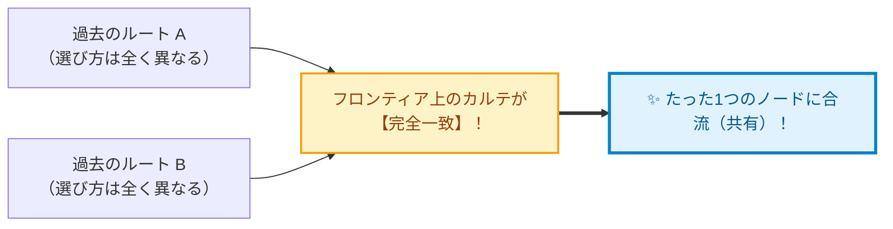

> 💡 **【直感イメージ：RPGの宿屋】**  
> 「森を抜けて宿屋に着いた勇者」と「洞窟を抜けて宿屋に着いた勇者」。過去の道順が違っても、**「同じ宿屋にいて、所持品・現在地カルテが同じ」なら、明日からの冒険の選択肢は100%同じ**です。だから別々に追跡せず、「宿屋」という1つの状態に合流させます！

フロンティア上のカルテが同じであれば、**「これ以降の未来の世界で、どのエッジを採用すれば合格できるか」という未来の運命は100%完全に同一**です。
したがって、コンピュータはこの2つの状態を別々に枝分かれさせず、ハッシュテーブルを用いて**「まったく同一の1つのノード」として合流**させます。

- **木構造（Tree）から DAG（有向非巡回グラフ）へ**:  
  通常の探索では枝分かれがツリー状に指数関数的に広がりますが、フロンティア法では等価な状態が次々と合流するため、探索空間は合流型のネットワーク（DAG）へと縮退します。

#### 💎 ゼロサプレス（Zero-suppression）によるZDDの結晶化
こうして構築されたDAGに対して、湊教授の**「ZDD簡約規則（ゼロサプレス・ルール）」**が適用されます。

一筆書きや部分構造の探索において、全エッジの大半は「使われない（0-枝）」のが普通です（スパース性）。  
ZDDは、**「あるエッジを使わない（0）を選んだとき、そのまま何も状態が変わらずに次のエッジへ抜ける冗長なノード」を丸ごと自動消去（バイパス）**します。

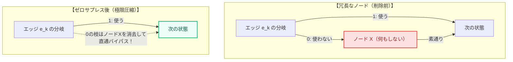

この「等価状態の合流」と「ゼロサプレス」という2重の圧縮機構により、天文学的な組み合わせの海から、有効な解の集合だけを極限までコンパクトに表現した**「ZDD（ゼロサプレス型二分決定グラフ）」**が結晶化するのです。

---

> 🚀 **【第5章のまとめ：フロンティア法を支える4大原理】**
>
> 1. **エッジ固定一列スキャン（工場長目線）**: 迷路を走らず、全エッジを1列に並べて $M$ 回進むだけで終了。
> 2. **フロンティア（境界線）メモ**: 過去の全行程を捨て、「境界線上に露出したノードの次数と相棒」だけを管理する。
> 3. **芽が出た瞬間の即時破棄（3大安全チェック）**: 両端2ノードの局所審査により、孤立・パンク・自爆ループを即時FAILへ消去。
> 4. **等価合流とゼロサプレス**: カルテが一致する状態を束ね、冗長な枝を抑制することで、超圧縮されたZDDを結晶化させる。

---

### 5.7 いざ実践へ：第6章へのバトンタッチ

ここまで学んだ内容は、あらゆるグラフ、あらゆる規模のネットワークに共通する**フロンティア法とZDDの普遍的なコア理論**です。

では、この美しく洗練されたアルゴリズムは、**実際のネットワーク上で具体的にどのように動き、カルテの数字は1ステップごとにどう書き換わっていくのでしょうか？**  
そして、最終的にどのようにしてあのコンパクトなZDDの図形へと組み上がるのでしょうか？

次章（第6章）では、この理論を肌で実感するために、**4つの駅（ノード）からなる具体的なモデルを舞台にして、コンピュータの手元のデータ推移を1コマずつ完全実況でコマ送り**していきます！

---

## 🎬 第6章：コマ送り実況とZDD — 4駅モデルで体験する超圧縮のメカニズム

第5章で、フロンティア法の驚くべき基本思想（ベルトコンベアによる一列スキャンと、駅カルテによる安全チェック）を学びました。  
ここからは、おなじみの4駅モデルを使って、**実際にコンピュータの手元でデータがどのように書き換わり、最終的にどうやってコンパクトなZDD（決定グラフ）へと結晶化するのか**を、1コマずつ完全実況で体験していきましょう！

---

### 6.1 コマ送りを読む前の最重要心得：進む単位は「エッジ」、記録するのは「駅」！

これから見るコマ送りを追うときは、次の対比を常に意識してください。

- **コマが進む単位**: **「エッジ（線路）ごと」**に1コマ進みます（$e_0 \to e_1 \to e_2 \to e_3$）。
- **データを書き換える対象**: **「駅（両端の駅カルテ）だけ」**を更新します！

線路自体には何も書き込まず、「いま見ている線路の両端の駅カルテの数字と相棒」だけをコツコツ書き換えていく作業がコマ送りの実態です。

---

### 6.2 結晶化の完全実況：路線図 × 作業カルテJSON × フローチャート × 作業中ZDD

第1章から登場しているおなじみの4駅モデルを使い、コンピュータの中で何が起きているのかを完全生中継します！

各線路をベルトコンベアで1本ずつ処理しながら、
1. **🗺️ 路線図**（いまどの線路を検査しているか）
2. **📋 作業カルテJSON**（手元の相棒や接続数がどう書き換わったか）
3. **🚦 フローチャート判定**（3大ルールチェックをどうくぐり抜けたか）
4. **🌳 作業中のZDD**（ZDDの木がどう育っていくか）
の4連動で、ZDD誕生の瞬間をリアルタイムに追いかけます。

> 📐 **読み方の約束（段階的圧縮）**  
> この章は **「型の習得 → 新現象の追加 → 型の応用」** の順で冗長を減らします。  
> - **$e_0$** — 4連フォーマットを**完全実況**（カルテJSON・判定・木の成長の型をここで固定）  
> - **$e_1$** — 再び完全実況。ただし **SUCCESS 直行** と **ゼロサプレスの予告** が新しく登場  
> - **$e_2$・$e_3$** — 型は同じなので **検証表に圧縮**（情報は落とさず、反復だけ省く）  
> - **完成ZDD** — 木の全体像はここで一括確認。生JSONの正本は **6.3**  
> 図中の JSON は説明用の**抜粋**です。合流判定の正本は **フロンティア上の全駅カルテ全体**（6.3 で再確認）。

---

#### 🗺️ 駅の位置関係（ベースマップ）

まずは4つの駅と、今回調べる4本の線路（エッジ $e_0 \sim e_3$）の位置関係を確認しましょう。

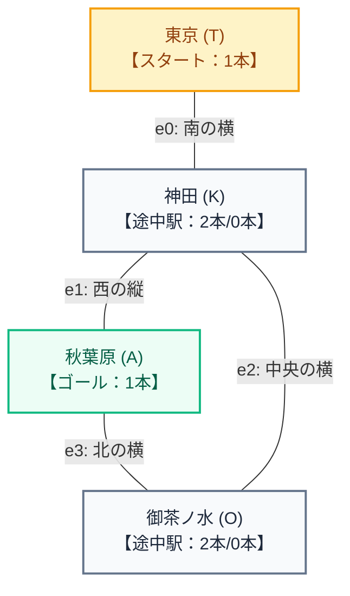

- **調べる線路の順序**:
  1. **$e_0$**: 東京 ── 神田 （南の横の線路）
  2. **$e_1$**: 神田 ── 秋葉原 （西の縦の線路）
  3. **$e_2$**: 神田 ── 御茶ノ水 （中央の横の線路）
  4. **$e_3$**: 御茶ノ水 ── 秋葉原 （北の横の線路）
- **各駅の役割と合格目標ルール**:
  - **東 京【発: 1本】**: スタート駅なので必ず「1本」で出発。
  - **秋葉原【着: 1本】**: ゴール駅なので必ず「1本」で到着。
  - **神 田【経: 2本 / 0本】**: 途中駅なので「通過（2本）」または「不使用（0本）」。
  - **御茶ノ水【経: 2本 / 0本】**: 途中駅なので「通過（2本）」または「不使用（0本）」。

---

#### 🏁 【準備】終端ノードの待機（ID 0 と ID 1）

ZDDを作り始める前、コンピュータのメモリには**判定用の2つの特別席（終端ノード）**が最初から用意されています。

- **ノードID `0`**: ❌ **FAIL**（失敗・行き止まり・ループ違反のゴミ箱）
- **ノードID `1`**: 🏆 **SUCCESS**（秋葉原到着・有効ルート完成のゴール）

この2つの出口に向かって、線路の質問ボックスを順番に組み立てていきます。

---

#### 📍 【線路 $e_0$：東京 ── 神田】の処理

- **🗺️ 路線図**: スタートの駅「東京」から「神田」へ伸びる線路 $e_0$ をベルトコンベアに乗せます。
- **選択の分岐**: 「使わない（0）」か「使う（1）」か？

##### 📋 手元の作業カルテJSON（★相棒の誕生と合流判定の基準！）
線路 $e_0$ を選んだ瞬間、プログラムのメモリ上では**相棒（Mate）と接続数（deg）を含む作業カルテ**が次のように生成・更新されます。

> ⚠️ **超重要：この作業カルテJSONは何を表しているのか？**  
> これは特定の線路だけの切れ端データではありません！  
> **「現在、境界線（フロンティア）上に立っている駅全員の最新名簿」**です。  
> 過去にどの線路を通ってきたか（履歴）は一切持たず、**「いま誰と誰がつながっているか（相棒）」と「いま何本つながったか（接続数）」だけ**を記録しています。  
> **この作業カルテJSONの中身こそが、後ほど別のルートと出会ったときに「合流できるかどうか」を判定・評価する唯一無二の基準になります！**  
> ※ 各コマの JSON は**変更があった駅だけ**を抜粋表示しています。プログラムが辞書引きに使うのは、**フロンティア上の全駅カルテをまとめた全体**です（1駅だけの一致では合流しません）。

```json
{
  "現在処理中の線路": "e0 (東京-神田)",
  "フロンティア上の駅カルテ": {
    "分岐0_使わない場合": {
      "東京": { "接続数": 0, "相棒": "東京(孤立)" }
    },
    "分岐1_使う場合": {
      "東京": { "接続数": 1, "相棒": "神田" },
      "神田": { "接続数": 1, "相棒": "東京" }
    }
  }
}
```
> 💡 **相棒データはここに現れていた！**  
> 「東京の相棒は神田」「神田の相棒は東京」というペア関係が、作業カルテの中にハッキリと記録されています！

##### 🚦 フローチャート判定
- **分岐 0（使わない）**:  
  東京駅はスタート駅（目標1本）なのに、接続0本のまま線路が通り過ぎてしまった！  
  ➔ 🚨 **ルール①【取り残し孤立違反】で即失格！** ➔ **【FAIL (ID 0)】へ直行！**
- **分岐 1（使う）**:  
  東京(1本)、神田(1本)。パンクなし、自爆ループなし。  
  ➔ ✅ **合格！** 次の線路 $e_1$ へ進む！

##### 🌳 作業中のZDD（線路 $e_0$ 終了時点）
メモリ上に最初の質問ノード `e0` が生まれ、0の枝は早くもゴミ箱（FAIL）へ合流しました！

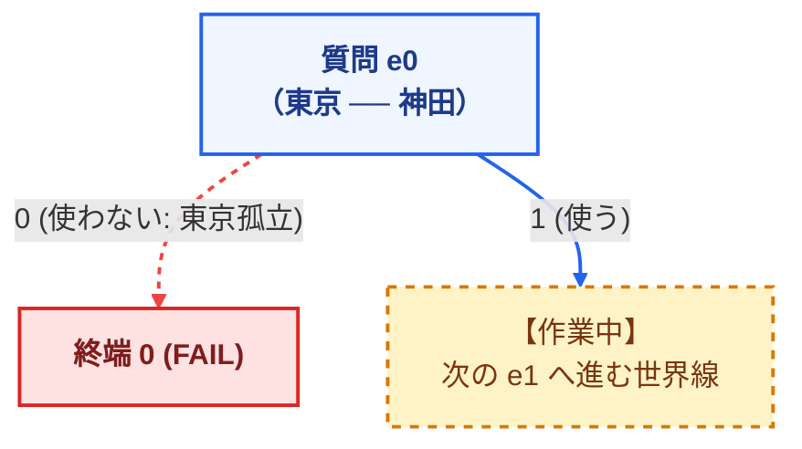

---

#### 📍 【線路 $e_1$：神田 ── 秋葉原】の処理

- **🗺️ 路線図**: 神田から秋葉原（ゴール）へ伸びる線路 $e_1$ をベルトコンベアに乗せます。
- **選択の分岐**: 線路 $e_0$ で生き残った世界線から、「使わない（0）」か「使う（1）」か？

##### 📋 手元の作業カルテJSON（★相棒の直結更新！）
```json
{
  "現在処理中の線路": "e1 (神田-秋葉原)",
  "分岐1_使う場合": {
    "神田": { "接続数": 2, "状態": "通過完了！（mate 省略＝もう端点ではない）" },
    "東京": { "接続数": 1, "相棒": "秋葉原" },
    "秋葉原": { "接続数": 1, "相棒": "東京" }
  },
  "分岐0_使わない場合": {
    "神田": { "接続数": 1, "相棒": "東京" },
    "メモ": "神田はまだ1本だが、残りの線路 e2 (御茶ノ水行き) があるのでセーフ"
  }
}
```

##### 🚦 フローチャート判定
- **分岐 1（使う）**:  
  神田駅が2本（通過完了）になり、スタート駅（東京）とゴール駅（秋葉原）がお互いの「相棒」としてガチッと直結！全員の合格目標が達成！  
  ➔ 🏆 **【大合格！ルート①直通完成！】** ➔ **【SUCCESS (ID 1)】へ直結！**  
  （※ ここから先の線路 $e_2, e_3$ は、使えばパンクするためすべて0を選ぶしかなく、**ゼロサプレス消滅則によってノード丸ごとスキップ**されます！）
- **分岐 0（使わない）**:  
  神田駅はまだ1本ですが、次の線路 $e_2$（御茶ノ水行き）が残っているためセーフ！  
  ➔ ✅ **合格！** 迂回ルートの探索へ進む。

##### 🌳 作業中のZDD（線路 $e_1$ 終了時点）
直通ルートが完成し、ゼロサプレスによって一気にゴール（SUCCESS）へ突き刺さるバイパスが開通しました！

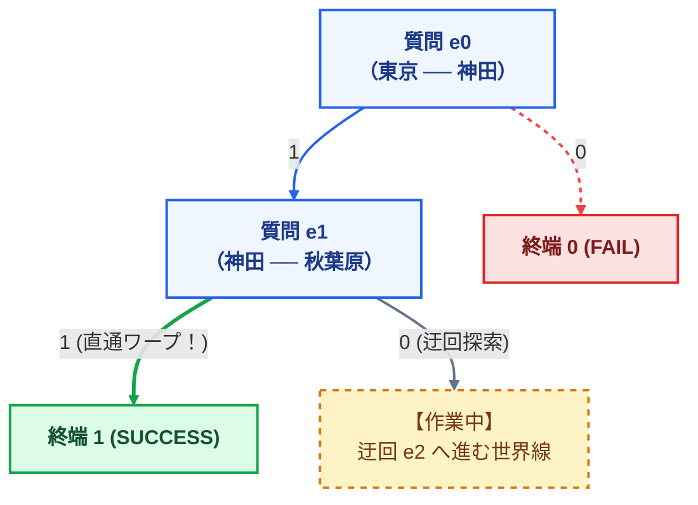

> 💡 **1の行き先が「1 (SUCCESS)」に確定！**  
> ゼロサプレスにより、中間の質問をスキップして直接ゴール（1）を指しています！

---

#### 📍 【線路 $e_2$・$e_3$：迂回ルートの検証表】

$e_0$・$e_1$ で4連フォーマットの型は身につきました。  
$e_2$・$e_3$ は **$e_1$ 分岐0（迂回）の世界線**を、同じ4観点を表に圧縮して追います（木の全体像は直後の完成ZDDで確認）。

| 線路 | 📋 カルテの要点（分岐1） | 🚦 判定の要点 | 🌳 ZDDへの影響 |
| :--- | :--- | :--- | :--- |
| **$e_2$** 神田─御茶ノ水 | 神田 deg=2（通過）。東京↔御茶ノ水が mate で直結 | 0 → 神田が最後の線路を捨てて**孤立** → FAIL / 1 → 合格、$e_3$ へ | ノード `e2` 追加。0枝 → FAIL、1枝 → 作業中 |
| **$e_3$** 御茶ノ水─秋葉原 | 御茶ノ水 deg=2。東京↔秋葉原が mate で直結（$e_1$ 直通と同型の全線開通） | 0 → 御茶ノ水孤立 → FAIL / 1 → **ルート②完成** → SUCCESS | ノード `e3` 追加。1枝が SUCCESS へ直結 |

> 🔁 **$e_1$ 分岐1（直通）と $e_3$ 分岐1（迂回完成）の対比**  
> どちらも「東京↔秋葉原が mate で直結し全線開通」ですが、**途中カルテは異なる**ため別世界線として残ります（4駅モデルでは中間ノード合流は起きません。合流の一般論は 6.3）。

---

#### 💎 【完成】これが4本の線路を経て結晶化した完成ZDDだ！

4本の線路の処理がすべて終わり、作業中の仮ノードがすべて実ノードとして確定しました。  
メモリに残ったのは、**たった4つの質問ノードと2つの終端ノード**です！

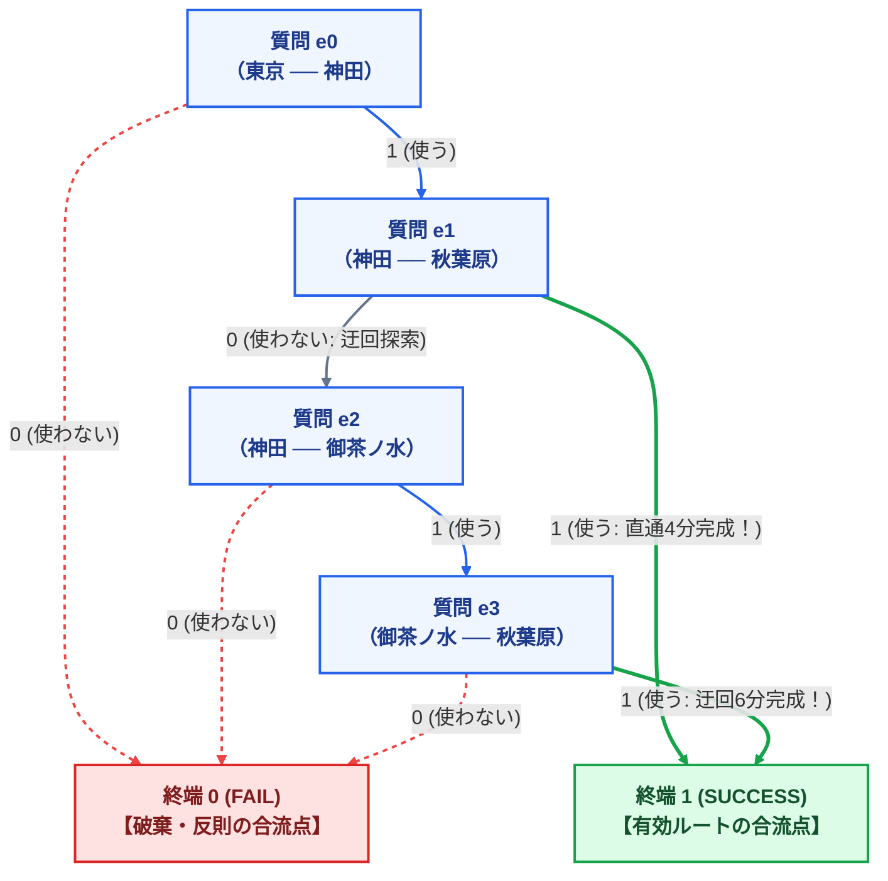

---

#### 🏗️ 【コラム】「相棒（Mate）」はどこへ消えたのか？ — 建築の足場理論

完成したZDDの図を見て、誰もがハッと気づきます。  
> **「あれ？ 作業カルテJSONの中であんなに大活躍していた『相棒: 神田』『相棒: 秋葉原』というデータは、完成したZDDのどこへ消えてしまったの？」**

答えは、**「相棒は、完成したZDDには1文字も残らない」**のです！

ビルを建設するとき、工事現場には頑丈な「鉄骨の足場」を組みますよね。  
でも、ビルが完成してお披露目するときには、足場はきれいに解体して撤去します。

- **工事中（フロンティア法の処理中）**:  
  パンクや自爆ループを防ぐための**安全確認用の足場**として「相棒（Mate）」が手元の作業カルテJSONで大活躍する。
- **完成後（結晶化したZDD）**:  
  安全確認が終わり、合格ルートが確定したら、足場（相棒）はすべて撤去！  
  手元に残るのは、**「0ならどこへ行く、1ならどこへ行く」という純粋な矢印（ノード）だけ**！

だから、完成したZDDは極限までスリムで美しく、余計なメタデータを一切持たないのです。

---

### 6.3 圧縮されたZDDデータの実物（JSON）と「真の解凍」

「では、完成したZDDは、コンピュータのファイルやメモリの中には具体的にどんなデータとして残っているのか？」  
「そして、そこからどうやって過去のルートを取り出すのか？」

---

#### 💾 1. これが「圧縮されたZDDデータ」の実物です！（生データJSON）

余計な装飾を一切省いた、コンピュータの中に保存されている**生のZDDデータ（JSON形式）**がこちらです！

```json
{
  "終端ノード": {
    "0": "❌ FAIL (失敗・失格のゴミ箱)",
    "1": "🏆 SUCCESS (秋葉原到着・合格)"
  },
  "質問ノード一覧": [
    { "ノードID": 2, "質問線路": "e3 (御茶ノ水-秋葉原)", "0の行き先": 0, "1の行き先": 1 },
    { "ノードID": 3, "質問線路": "e2 (神田-御茶ノ水)",   "0の行き先": 0, "1の行き先": 2 },
    { "ノードID": 4, "質問線路": "e1 (神田-秋葉原)",     "0の行き先": 3, "1の行き先": 1 },
    { "ノードID": 5, "質問線路": "e0 (東京-神田)",       "0の行き先": 0, "1の行き先": 4 }
  ],
  "探索スタート地点": 5
}
```

---

#### 🔤 読者の疑問を一瞬で解消する3つのポイント！

1. **ノードID `0` と `1` が一覧にないのはなぜ？**  
   ➔ `0` と `1` は、合否判定のための**予約席（定数）**だからです！  
   そのため、線路の質問ノードは予約席の次の番号である **`2番` から順番に命名**されています。

2. **最初の線路 $e_0$ が、なぜ一番下の「ノード 5」なの？**  
   ➔ **ゴール側（後ろ）から手前に向かって組み立てた（ボトムアップ構築）から**です！  
   まず出口（0と1）が決まり、出口に直結する $e_3$（ノード2）が決まり、その手前の $e_2$（ノード3）が決まり……と遡ったため、スタートの $e_0$ が最後に作られて「ノード5」になったのです。

3. **「路線図のエッジ」と「ZDDのノード」は何が違うの？**  
   ➔ **「実質的に同じもの」**です！  
   路線図の1本の線路（エッジ）が、ZDDの中では「その線路を使うか使わないか」のスイッチ（ノード）という役割で登場しています。

---

#### 🔍 2. 真の解凍実況：外の表は見ない！SUCCESSへの道を辿るだけ！

「ZDDの中にルートが保存されているなら、外部のデータなんて見ずに、このZDD単体からルートを取り出せるはずでは？」

**まさにその通りです！**  
本当の「解凍（ルートの復元）」では、外の表なんて一切見ません。  
手元にあるのは、上の**たった4行のZDDデータ（またはグラフ）だけ**です！

ルールは至極単純：
> **「赤のFAIL（0）へ行く矢印は行き止まりだから無視し、緑のSUCCESS（1）に繋がる矢印だけを指でなぞる！」**

---

##### 🚶 実況1：直通ルートを取り出す
1. スタート地点である **ノード 5（$e_0$）** に立つ。
   - `0の行き先` ➔ 0（FAIL）なので行き止まり！無視！
   - `1の行き先` ➔ **ノード 4** へ行ける！  
     ➔ **判断：「線路 $e_0$ を使うぞ！」とメモ。**
2. **ノード 4（$e_1$）** に立つ。
   - `1の行き先` を見る ➔ **なんと直接 `1 (SUCCESS)` だ！**  
     ➔ **判断：「線路 $e_1$ を使うぞ！」とメモしてゴール！**
3. 🏁 **手元のメモは $\{e_0, e_1\}$ ＝ 「東京 ➔ 神田 ➔ 秋葉原（直通4分）」が完全復元！**

##### 🚶 実況2：迂回ルートを取り出す
今度は、ノード4でもう一つの道（0の行き先）を進んでみます。

1. **ノード 5（$e_0$）** ➔ `1の行き先`（$e_0$ を使う）➔ **ノード 4** へ。
2. **ノード 4（$e_1$）** ➔ `0の行き先`（$e_1$ は使わない）➔ **ノード 3** へ。
3. **ノード 3（$e_2$）** に立つ。
   - `0` は FAIL なので無視。`1の行き先` ➔ **ノード 2** へ行ける！  
     ➔ **判断：「線路 $e_2$ を使うぞ！」とメモ。**
4. **ノード 2（$e_3$）** に立つ。
   - `0` は FAIL なので無視。`1の行き先` ➔ **`1 (SUCCESS)` 到達！**  
     ➔ **判断：「線路 $e_3$ を使うぞ！」とメモしてゴール！**
5. 🏁 **手元のメモは $\{e_0, e_2, e_3\}$ ＝ 「東京 ➔ 神田 ➔ 御茶ノ水 ➔ 秋葉原（迂回6分）」が完全復元！**

---

いかがでしょうか？  
外部のデータなんて何一つ見なくても、**「SUCCESSへ続く矢印」をなぞるだけで、ZDDの中から正解ルートが寸分違わずポロポロと湧き出てくる**ことが実感できたはずです！

---

#### 🤝 【さらに深く】駅数が増えたときの「中間ノード等価合流」とは？

「4駅モデルでは直通ルートがゼロサプレスで飛び越えましたが、もっと駅数が多い複雑な路線網では、途中の質問ノード自体が合流することはあるのですか？」

**もちろんあります！** それが5.6節で解説した「RPGの宿屋の法則（等価状態の合流）」です。  
では、**具体的に「何と何」が一致したときに合流とみなすのでしょうか？**

答えは、**フロンティア上の全駅について、接続数（deg）と相棒（mate）の組が集合として完全一致したとき**です！（下の図は渋谷1駅だけを抜粋した例です。）

```text
【過去のルートX（例: 新宿➔代々木➔渋谷）】    【過去のルートY（例: 新宿➔原宿➔渋谷）】
      │                                             │
      ▼ 手元の作業カルテJSON                         ▼ 手元の作業カルテJSON
{                                             {
  "渋谷": { "接続数": 1, "相棒": "新宿" }        "渋谷": { "接続数": 1, "相棒": "新宿" }
}                                             }
      ＼                                           ／
        ★ 作業カルテJSONが完全一致！（辞書引きでヒット）
        ➔「過去の道順は違うが、現在の接続状況は全く同じだ！」
        ➔「ここから先の未来で起きる運命は100%同じ！」と判定
        ➔ 新しいノードは作らず、既存ノードへ矢印を合流（相乗り）させる！
```

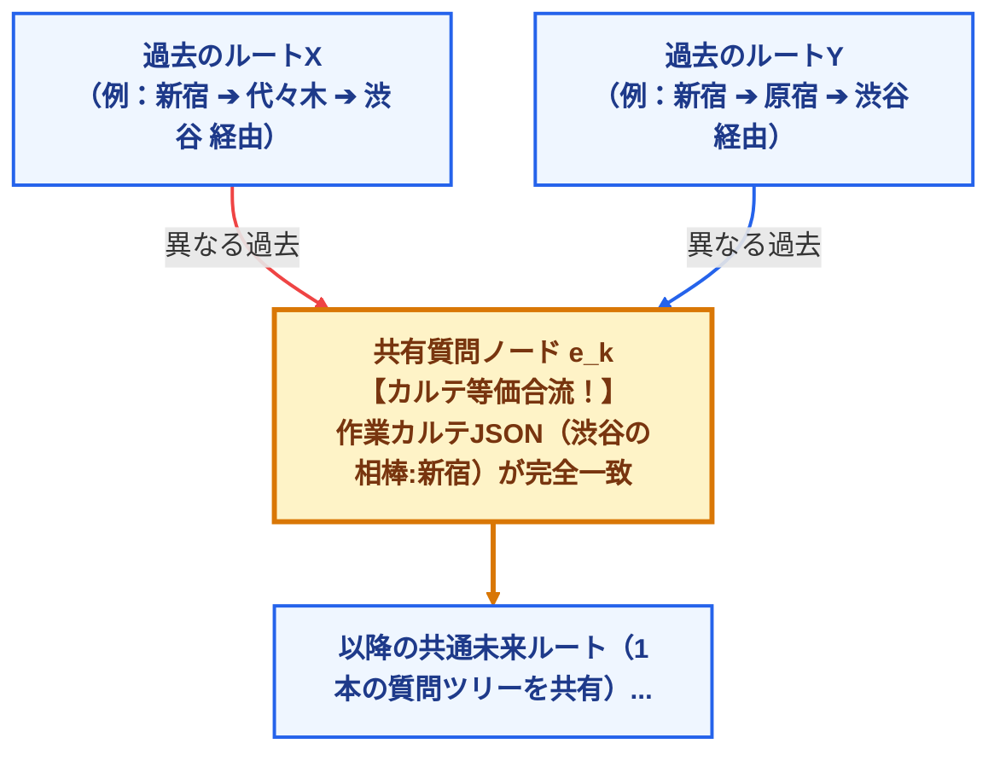

このように、合流を評価・判定するための情報は**すべて作業カルテJSONの中に詰まっています**。  
「どの線路を通ってきたか（履歴）」は比較しません。**「手元の作業カルテJSONが同じかどうか」だけを照合するからこそ、瞬時に合流を判定できる**のです。

このように、フロンティア法では：
1. **行き止まりやループ違反は即座に FAIL へ合流**
2. **同じカルテ状態になった世界線は 中間ノードへ合流**
3. **完成した有効ルートはすべて SUCCESS へ合流**
4. **不要な質問ノードは ゼロサプレスで消滅**

この4つの合流・縮退の力が同時に働くことで、都内JRの $10^{29}$ 通りという天文学的な世界線が、数千ノードというパソコンのメモリに余裕で収まるサイズにギュッと結晶化（DAG化）されるのです。

---

### 6.4 【コラム・実装編】メモリの深淵 — コンピュータの中でデータはどう動いているのか？

> 📌 **読み飛ばし可。** 6.2〜6.3 で概念は完結しています。実装・データ構造に進む読者向けの深掘りです。

「概念や図解は分かった。では、**コンピュータのメモリ（RAM）上では、具体的にどんな形式でデータが残され、合流や消滅の瞬間に変数はどう動いているのか？**」  
プログラムの実装やデータ構造の視点から、内部動作を解き明かします。

---

#### 💾 1. メモリの実体：「たった3つの数字」が入った配列テーブル

「東京 ➔ 神田 ➔ 秋葉原」といった**ルートの文字列データは、メモリには1文字も保存されていません**。  
ZDDのノード1個の実体は、C言語やPythonで見ると**たった3つの整数（タプル）**です。

```c
// C言語ならたったこれだけの構造体
struct Node {
    int edge_id; // 質問する線路の番号 (e0, e1, ...)
    int child0;  // 「使わない(0)」を選んだときの行き先ノード番号（ポインタ）
    int child1;  // 「使う(1)」を選んだときの行き先ノード番号（ポインタ）
};
```

4駅モデルにおいて、最終的にパソコンのメモリに残る全データは、**以下の表（たった6行の配列）がすべて**です！

| ノードID | 質問する線路 | `child0`（使わない時の行き先） | `child1`（使う時の行き先） | メモリ上の役割と意味 |
| :---: | :---: | :---: | :---: | :--- |
| **0** | (終端) | — | — | ❌ **FAIL**（失敗・行き止まり・ループの合流点） |
| **1** | (終端) | — | — | 🏆 **SUCCESS**（秋葉原到着・合格ルートの合流点） |
| **2** | **$e_3$** (御茶ノ水-秋葉原) | **0** (FAIL) | **1** (SUCCESS) | 迂回ルート②の最終判定ノード |
| **3** | **$e_2$** (神田-御茶ノ水) | **0** (FAIL) | **2** (ノード2へ) | 神田から御茶ノ水へ進む判定ノード |
| **4** | **$e_1$** (神田-秋葉原) | **3** (ノード3へ) | **1** (SUCCESS直通！) | ★ゼロサプレスでchild1が直接SUCCESSを指す！ |
| **5** | **$e_0$** (東京-神田) | **0** (FAIL) | **4** (ノード4へ) | 探索のスタート地点（根ノード） |

---

#### 🔍 2. ルート復元（解凍）

上の配列表から `child0` / `child1` を辿る手順は、**6.3「真の解凍実況」**と同じです（`0の行き先` ↔ `child0`、`1の行き先` ↔ `child1` の読み替えだけ）。ここでは実装用の表記に統一した正本として掲載しています。

---

#### 🎬 3. 「等価合流」が起きる瞬間のデータ実況（辞書引きとポインタ代入）

では、プログラムの実行中、2つのルートが「合流」するときは何が起きているのでしょうか？  
合流を司る司令塔は、プログラム内部の**「カルテ辞書（ハッシュテーブル）」**です。

```text
【司令塔：カルテ辞書（visited_table）】
・Key  （検索キー）: 手元の「作業カルテJSON」（境界駅の相棒 mate と 接続数 deg）
・Value（値）      : そのカルテに対してすでに作成された「ZDDノードID」
```
> 💡 **合流評価のからくり：**  
> プログラムは、手元の作業カルテJSONをそのまま「検索キー（Key）」にして辞書を引きます。  
> だから、**フロンティア上の全駅カルテ（各駅の mate と deg の組）が集合として一致していれば**、瞬時に既存のノード番号が見つかり、合流が成功するのです！

##### 📍 コマ1：ルートAがやってきた（新規作成）
1. 「ルートA」がある駅の前に到達した。手元のカルテは `【神田: 接続1本, 相棒: 東京】`。
2. プログラムが辞書を引く：
   `if カルテ not in visited_table:` ➔ **「まだ辞書にない！（初登場）」**
3. 新しい質問ノードをメモリに確保：**`ノード 20` を新規作成！**
4. 辞書に登録：`visited_table[カルテ] = 20`
5. ルートAの親ノードの行き先変数に書き込む：**`ルートAの親.child = 20`**

##### 📍 コマ2：ルートBがやってきた（★合流発生！）
1. 全く別の道を遠回りしてきた「ルートB」が、たまたま同じ駅の前に到達した。
2. 手元のカルテを調べると……偶然にも `【神田: 接続1本, 相棒: 東京】` に一致した！
3. プログラムが辞書を引く：
   `if カルテ in visited_table:` ➔ **「あった！さっきルートAの時に作った `20` だ！」**
4. **【ここが合流の瞬間！】**
   - **新規ノードのメモリ確保（malloc）をキャンセル（破棄）！**
   - 辞書から取ってきた既存の `20` を、ルートBの親の行き先変数に書き込む：
     **`ルートBの親.child = 20`**

```text
【メモリ上のポインタの動き】
ルートAの親ノード（ID: 10）: child = 20  ──┐
                                          ├──> [ ノード 20 ] （メモリ上には1個だけ！）
ルートBの親ノード（ID: 11）: child = 20  ──┘
```

> 💡 **合流とは「ポインタ変数に既存のID番号を代入しただけ」**  
> 通常の木探索ならルートBのためにわざわざ `ノード 21` を作り、その下の未来ツリー（何千ノード）も2重に複製してしまいます。  
> しかしフロンティア法は、**行き先番号を `20` にするだけで、ノード20から先に広がる未来のツリー全体を、ルートAとルートBに「まるごと相乗り（共有）」**させます。

---

#### ⚡ 4. 「ゼロサプレス消滅」のデータの動き（たった1行のif文）

直通ルートで秋葉原に着いた後、なぜ $e_2$ や $e_3$ の質問箱が消えてワープしたのか？  
プログラムの中では、ノードを作るときに**たった1行のチェック**が走っています。

```python
# ※ 4駅・一筆書きモデル向けの「教學用」簡略コード（一般ZDDの high=0 削除とは表記が異なる）
def make_node(edge_id, child0, child1):
    if child1 == 0:  # 「使う(1)」の行き先が FAIL (0) なら...
        return child0  # 新ノードを作らず child0 をそのまま返す（素通りバイパス）
    return create_new_node(edge_id, child0, child1)
```

1. 神田➔秋葉原（$e_1$）を使った時点でゴール（秋葉原）に到達した。
2. 次の線路 $e_2$（御茶ノ水行き）をチェックすると：
   - 「使う（1）」➔ 駅がパンクして **`child1 = 0 (FAIL)`**
   - 「使わない（0）」➔ そのまま秋葉原でゴール **`child0 = 1 (SUCCESS)`**
3. `make_node` 関数が判定する：
   > 「おや？ $e_2$ は `child1 == 0` だな！ **ノード $e_2$ はメモリに作らない！**」  
   > 「代わりに、`child0` に入っている **`1 (SUCCESS)` をそのまま親（$e_1$）に返しちゃえ！**」
4. 親（$e_1$）の行き先変数に直接代入される：
   > **`Node_e1.child1 = 1 (SUCCESS)`**

メモリ上に $e_2$ や $e_3$ のノードを一切作らず、**ポインタ変数の数値を直接ゴール（1）に書き換えた**。  
これが、画面上では**「質問箱が消え去って、緑の太線がゴールへ直通ワープした」**というデータの動きの正体です。

---

#### 🗑️ 5. 「FAIL合流」のデータの動き（探索の即時蒸発）

16個の葉のうち14個が消えるメカニズムも極めてシンプルです。

1. カルテ検査で「行き止まり」「ループ」「パンク」の違反が見つかった。
2. プログラムはその世界線の行き先変数に、**固定値 `0`（FAILのノードID）を代入するだけ**！
   > **`親ノード.child = 0`**
3. その先につながるはずだった何万個もの未来のノードは、**1行もプログラムが実行されず、メモリ確保も一切されずにその場で蒸発**します。

---

### 6.5 実測データが証明する驚異的な圧縮率
東京都内JRネットワーク（87駅・98エッジ）においてフロンティア法を実行した際の実測解析値は、この理論の圧倒的な正しさを証明しています。

- **全探索空間**: $2^{98} \approx 6.3 \times 10^{29}$ 通り（天文学的爆発）
- **境界線上に同時に存在する駅数の平均**: **わずか 5.69 駅！**
- **境界線上に同時に存在する駅数の最大値**: **わずか 12 駅！！**

$10^{29}$ という宇宙規模の組み合わせ空間が、**「同時に最大12駅の接続状態を管理するだけ」**で完全に統制されました。  
過去のGPS日記を捨て、前線の接続メモだけを更新していく――この極めてシンプルな発想の転換こそが、現代情報科学の金字塔と呼ばれるフロンティア法の真髄なのです。

---

## 🏆 第7章：DAG上の動的計画法による厳密最長解の特定

### 7.1 圧縮グラフ（DAG）の構造美
フロンティア法によって生成されたZDDは、数学的には**DAG（Directed Acyclic Graph / 有向非巡回グラフ：ダグ）**の構造を持ちます。

DAGとは、**「内部に循環ループを持たず、過去から未来へと一方向にのみ流れる層状のネットワーク」**です。  
あれほど私たちを悩ませた「山手線の無限ループ」は、フロンティアを通過する過程で完全に解消され、整然とした一本の「川」のような構造へと生まれ変わっています。

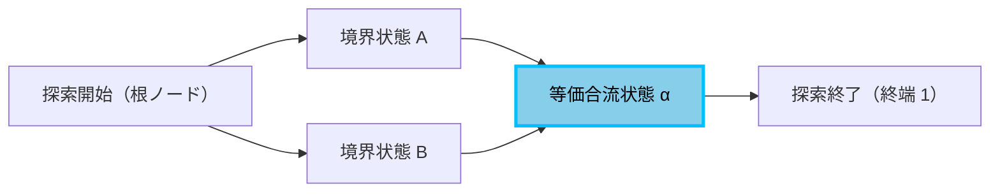

### 7.2 動的計画法（DP）による線形時間での厳密最適化
一度DAGが構築されてしまえば、真の「一筆書き最長ルート」を特定することは極めて容易です。

終端ノード（ゴール）から逆向きに、**各ノードにおける最長累積距離を後ろ向きに足し算しながら手繰り寄せる（動的計画法：Dynamic Programming / ディーピー）**だけで完了します。

計算時間は、ZDDのノード数に正比例する**線形時間 $O(|ZDD|)$**（オーダー・ゼットディーディーの絶対値）です。  
$10^{29}$ 通りという天文学的な砂漠の中から、妥協のない「真の最長一筆書きルート」が、一般的なコンピュータ上でわずか0.01秒で厳密に特定されます。

---

## 🚀 第8章：現代社会と最先端サイエンスを支える応用領域

身近な電車の路線図から出発した私たちの探究は、現代の情報社会や最先端科学の屋台骨を支える重要な技術領域へと直結しています。

### 8.1 AI・ディープラーニング（深層学習）との交差点
現代のAI技術の中核を成すディープニューラルネットワークにおいて、標準的に用いられる活性化関数が**「ReLU（Rectified Linear Unit：レルー）」**です。

$$ \text{ReLU}(x) = \max(0, x) $$

> 🗣️ **【用語の読み方ガイド⑥：ReLU】**
>
> - **ReLU の読み方**:
>     - **「レルー」** または **「ランプかんすう（ランプ関数）」**。
>     - $x$ が 0 より大きければそのまま $x$ を出力し、0 以下なら 0 を出力するシンプルな関数です。

この数式は、本テキスト第4章で学んだ**Max-Plus代数そのもの**です。  
現代の数理科学では、「ディープニューラルネットワークの入出力関係は、高次元空間におけるトロピカル多項式であり、その決定境界はトロピカル超曲面である」という幾何学的な解析が進められています。AIの判断ロジックの透明性を解明する鍵として、トロピカル代数は最前線の研究テーマとなっています。

### 8.2 圏論（ローヴェア計量空間）：世界を抽象化する共通言語
20世紀を代表する数学者ウィリアム・ローヴェア（F. William Lawvere）は1973年、数学界に衝撃を与える論文を発表しました。
> **「私たちが知る距離空間（Metric Space）とは、トロピカル半環 $[0, \infty]$ で豊穣された圏（Enriched Category：ほうじょうされたけん）に他ならない。」**

- **対象（Object：たいしょう）**: 駅や地点
- **射（Morphism：しゃ）**: 移動コスト（距離や所要時間）
- **射の合成と三角不等式**: $d(A, B) + d(B, C) \ge d(A, C)$

私たちが日常的に行っている「乗り換えや移動」という営みそのものが、現代抽象数学の到達点である「圏論」の公理をそのまま体現していたのです。

### 8.3 社会インフラ・防災システムへの実践的応用
湊教授のZDDとフロンティア法は、理論の美しさにとどまらず、社会インフラの強靭化やビッグデータ解析に不可欠な基盤技術として広く実用化されています。

---

### 8.4 【特別付録】身近な2大応用モデル：エッジ・ノードの対応とコマ送りデータ追跡

鉄道の「一筆書き大回り」で学んだ**「フロンティア法（エッジを流し、ノードのカルテで判定する）」**と**「ZDD（同一状態を合流して超圧縮する）」**という発想は、全く異なる身近な世界でもそのまま活用されています。

ここでは、**「何がエッジで、何がノードなのか？」「手元データはどう記録されるのか？」**を本文と全く同じ解像度で完全図解します！

---

#### 🗺️ 本文（鉄道）と2大応用モデルの「概念対応表」

まず、頭の中の地図を合わせるために、本文の要素がどう置き換わるのかを一覧で確認しましょう。

| 要素 | 🚂 鉄道モデル（本文） | 🛒 応用例①：Amazonおすすめ商品 | 🌊 応用例②：リアルタイム避難誘導 |
| :--- | :--- | :--- | :--- |
| **審査するエッジ（ベルトコンベア）** | **線路 $e_0, e_1\dots$**（使う1／使わない0） | **商品アイテム**（カゴに入れる1／入れない0） | **道路**（何人通すか：流量の選択） |
| **チェック対象のノード** | **駅**（交差点） | **顧客レシート（購買グループ）** | **地区・交差点・避難広場** |
| **手元に残す生データ** | 駅カルテ：**【接続本数】【相棒】** | レシートカルテ：**【残存する顧客リスト / 人数】** | 交差点カルテ：**【残された住民数 / 滞留人数】** |
| **あらかじめ決まっている目標ルール** | 各駅の合格目標（スタート1本、途中2本） | 推薦に必要な最小購入人数（しきい値・支持度） | 各道路の定員（キャパシティ）と全員脱出（0人） |
| **候補除外（FAIL）の条件** | パンク（2本超え）、自爆ループ、孤立 | 購入人数が基準未満（誰も買っていない組み合わせ） | 道路の定員オーバー、住民の取り残し（遭難） |
| **同一状態の合流（ノード共有）** | 駅カルテが一致した世界線同士を合体 | 残存する顧客パターンが一致した世界線同士を合体 | 各交差点の残存人数が一致した世界線同士を合体 |

---

#### 🛒 応用例①：Amazonおすすめ商品の「アイテム集合ZDD」

ネット通販で「ビールを買った人は、おつまみも買うか？」という相関ルールをあぶり出すモデルです。

##### 【問題設定】

- **エッジ（順番に審査する商品）**: ①ビール ➔ ②おつまみ ➔ ③おむつ
- **ノード（照合する購入者レシート）**: 客A, 客B, 客C（全3人）
- **手元カルテに残す生データ**: **「その条件に合致する残存顧客リスト」**
- **合格目標ルール（しきい値）**: **「購入者が 2人以上 いる組み合わせだけ残す！」**（※1人以下しか買っていない組み合わせは即座に枝刈り）

```text
【顧客レシートの原本】
・客A：［ビール, おつまみ, おむつ］
・客B：［ビール, おつまみ］
・客C：［おつまみ, おむつ］
```

##### 🎬 コマ送り実況中継（データ更新とチェックポイント）

###### 🎬 コマ1：商品「ビール」を審査する
| 選択肢 | 判定前の手元データ | 審査後の手元データ（残存顧客） | チェックポイント（合格目標：2人以上） | メモリへの残し方（ZDD） |
| :--- | :--- | :--- | :--- | :--- |
| **0（買わない道）** | 全員［客A, 客B, 客C］（3人） | **［客C］（1人）** | 客Cの1人のみ（2人未満で不合格！） ➔ **【FAIL（枝刈り消滅）】** | ❌ ゴミ箱（FAIL終端）へ |
| **1（買う道）** | 全員［客A, 客B, 客C］（3人） | **［客A, 客B］（2人）** | 2人以上購入しており合格！ ➔ **【合格・採用！】** | `Node_ビール` の「1」の矢印を次のコマへ伸ばす |

---

###### 🎬 コマ2：商品「おつまみ」を審査する
（※コマ1で生き残った `Node_ビール(1)` のデータ［客A, 客B］に対して審査）

| 選択肢 | 判定前の手元データ | 審査後の手元データ（残存顧客） | チェックポイント（合格目標：2人以上） | メモリへの残し方（ZDD） |
| :--- | :--- | :--- | :--- | :--- |
| **0（買わない道）** | ［客A, 客B］（2人） | **［ 0人 ］** | 誰も買っていない（0人） ➔ **【FAIL（消滅）】** | ❌ ゴミ箱（FAIL終端）へ |
| **1（買う道）** | ［客A, 客B］（2人） | **［客A, 客B］（2人）** | 客Aも客Bもおつまみを購入！2人以上で合格！ ➔ **【合格・採用！】** | `Node_おつまみ` の「1」の矢印を次のコマへ伸ばす |

> 🌟 **【メモリへの残し方の魔法（合流・圧縮）！】**
> ここでコンピュータは「客A」「客B」という個別の名前を完全に消去します！  
> メモリにはただ**「ビールとおつまみを買った人（人数：2人）」という1つのノード**だけを記録し、客Aと客Bのデータを1つに合体（共有）します！

---

###### 🎬 コマ3：商品「おむつ」を審査する
（※合流した「ビール＋おつまみ（人数：2人）」に対して、最後におむつを審査）

| 選択肢 | 判定前の手元データ | 審査後の手元データ | チェックポイントと意味 | メモリへの残し方（ZDD） |
| :--- | :--- | :--- | :--- | :--- |
| **0（買わない道）** | ［客A, 客B］（2人） | **［客B］（1人）** | ビールとおつまみだけ買った人（1人） | `Node_おむつ` の「0」の矢印 ➔ **【SUCCESS（セットA確定）】** |
| **1（買う道）** | ［客A, 客B］（2人） | **［客A］（1人）** | おむつまで全部買った人（1人） | `Node_おむつ` の「1」の矢印 ➔ **【SUCCESS（セットB確定）】** |

##### 💡 完成したデータ構造（何が残るのか？）
メモリの中に残るのは、たった3つの質問ボックスです：
```text
・Node_ビール   : [1] ➔ Node_おつまみ へ
・Node_おつまみ : [1] ➔ Node_おむつ へ
・Node_おむつ   : [0] ➔ ビール＋おつまみセット（購入者：客B）
                 [1] ➔ ビール＋おつまみ＋おむつセット（購入者：客A）
```
「ビールとおつまみを買った人が、次におむつを買う確率」を計算したいとき、Amazonのサーバーは何億行もの購入履歴を検索しません。  
このZDDの `Node_おむつ` の分岐（0が1人、1が1人）を見るだけで、**「確率は $1 \div 2 = 50\%$ だ！」と 0.0001 秒で計算して画面におすすめ商品を表示**しているのです！

---

#### 🌊 応用例②：リアルタイム避難誘導の「容量制約付きフローZDD」

地震や津波が発生した際、街中の道路の「幅（通行定員）」を考慮して、全住民を安全な高台へ逃がす最短避難計画です。

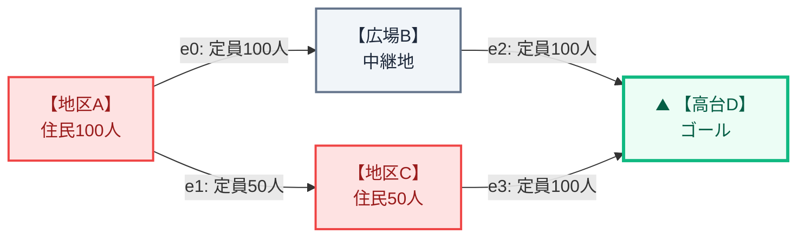

- **住民の初期配置**:
  - 地区A：100人
  - 地区C：50人
  - 広場B：0人（中継地点）
- **道路の定員（キャパシティ）**:
  - 道路 $e_0$（地区A ➔ 広場B）：最大100人
  - 道路 $e_1$（地区A ➔ 地区C）：最大50人
  - 道路 $e_2$（広場B ➔ 高台D）：最大100人
  - 道路 $e_3$（地区C ➔ 高台D）：最大100人
- **合格ルール**:
  - 道路の定員を絶対にオーバーしないこと（渋滞事故の防止）。
  - **すべての住民（合計150人）が高台Dに避難完了すること（取り残しゼロ！）**。

---

##### 🎬 コマ送り審査：住民カルテの推移

道路を1本ずつ審査しながら、各交差点・広場に残っている「住民の人数」をカルテで更新していきます。

###### 🎬 コマ1：道路 $e_0$（地区A ➔ 広場B：定員100人）を審査する

- **両端のノード**: 地区A（出発地）と 広場B（中継地）
- **手元カルテのデータ更新とチェック**:
  | 選択肢 | 地区Aカルテ（残存数） | 広場Bカルテ（滞留数） | チェックポイント（定員と孤立） | メモリへの残し方（ZDD） |
  | :--- | :---: | :---: | :--- | :--- |
  | **0（0人通す）** | **100人**（そのまま） | **0人** | 地区Aにはまだ道路 $e_1$ があるのでセーフ | `Node_e0` の「0」を次のコマへ伸ばす |
  | **1（100人通す）** | $100 - 100 =$ **0人！** | $0 + 100 =$ **100人** | 道路定員（100人）以内！地区Aは避難完了！ | `Node_e0` の「1」を次のコマへ伸ばす |

---

###### 🎬 コマ2：道路 $e_1$（地区A ➔ 地区C：定員50人）を審査する

- **両端のノード**: 地区A（出発地）と 地区C（合流地）
- **審査内容**:
  - もしコマ1で「$e_0 = 0$（地区Aから広場Bへ誰も通さなかった）」を選んでいた場合：
    - 地区Aには100人残っていますが、道路 $e_1$ は「定員50人」しかありません！
    - 残る50人が地区Aに取り残されて津波に巻き込まれてしまいます（取り残し違反）。
    - ➔ **【FAIL（除外！）】として即座に除外！**
  - コマ1で「$e_0 = 1$（100人全員脱出済み）」を選んでいた場合：
    - 地区Aはすでに0人なので、$e_1$ には0人通せばOK！
    - ➔ **合格！次のコマへ進む！**

---

###### 🎬 コマ3：道路 $e_2$（広場B ➔ 高台D：定員100人）を審査する

- **両端のノード**: 広場B（上流）と 高台D（ゴール）
- **手元カルテのデータ更新とチェック**:
  | 選択肢 | 広場Bカルテ（滞留数） | 高台Dカルテ（到着数） | チェックポイント（定員と孤立） | メモリへの残し方（ZDD） |
  | :--- | :---: | :---: | :--- | :--- |
  | **0（0人通す）** | **100人**（取り残し） | **0人** | 広場Bにとってこれが最後の出口道路！100人を放置したら孤立遭難 ➔ **【FAIL（除外！）】** | ❌ 候補から除外（FAIL） |
  | **1（100人通す）** | $100 - 100 =$ **0人！** | $0 + 100 =$ **100人** | 道路定員（100人）以内！広場Bの滞留ゼロ達成！ ➔ **【合格・採用！】** | `Node_e2` の「1」を次のコマへ伸ばす |

---

###### 🎬 コマ4：道路 $e_3$（地区C ➔ 高台D：定員100人）を審査する

- **両端のノード**: 地区C（上流）と 高台D（ゴール）
- **手元カルテのデータ更新とチェック**:
  | 選択肢 | 地区Cカルテ（残存数） | 高台Dカルテ（到着数） | チェックポイント（定員と孤立） | メモリへの残し方（ZDD） |
  | :--- | :---: | :---: | :--- | :--- |
  | **0（0人通す）** | **50人**（取り残し） | **100人** | 地区Cにとって最後の出口道路をスルーしたため孤立違反 ➔ **【FAIL（除外！）】** | ❌ 候補から除外（FAIL） |
  | **1（50人通す）** | $50 - 50 =$ **0人！** | $100 + 50 =$ **150人！** | 道路定員（100人）以内！全住民（150人）高台到着！ ➔ ⭐ **【SUCCESS（完成！）】** | 終端 SUCCESS へ接続！ |

---

##### 🚨 突発事態：橋が崩落したとき、ZDDはどう威力を発揮するのか？

もし地震発生から数分後、「道路 $e_0$ が津波で冠水して通行不能になった！」という情報が入ったとします。

- **従来のシステム**: 最初から全ルートを再探索・再計算しなければならず、計算中に津波が押し寄せて手遅れになります。
- **フロンティア法（ZDD）**:
  すでに「あらゆる有効な避難パターン」がZDDとしてメモリに保存されています。  
  したがって、**ZDDの根元にある「$e_0 = 0$（道路 $e_0$ を使わない）」という枝の先を一瞬で参照するだけ**です！
  すると、

  - 「地区Aの100人のうち、50人は道路 $e_1$ を通って地区C経由で高台へ逃げよ！」
  - 「残る50人は、広場Bの高層ビル屋上へ垂直避難せよ！」
  という次善の最適誘導計画が、**わずか0.01秒で瞬時に街中へ発信される**のです！

---

このようにつまり、「電車の線路」を「商品」や「避難道路」に置き換えても、

1. **エッジ（線路／商品／道路）を1列に流す**
2. **手元のノード（駅／顧客／交差点）のカルテをチェックしてルール違反をその場で除外する**
3. **同じ状態を合体してZDDに圧縮する**
という全く同一の数理メカニズムが、世界中のビッグデータ分析や人命救助の最前線で動いているのです。

---


## 🏁 おわりに：シミュレーターで「数理の手触り」を体感する

本書を通じて、電車の路線図という身近な題材の背後に広がる壮大な数学的景観をご覧いただきました。

- 最短経路を探索から代数の積へと昇華させた**「トロピカル半環」**
- 単純パス制約によって立ちはだかる**「NP困難の壁」**
- 過去の全履歴を捨て、現在の切断状態に集約させた**「フロンティア法」**
- そして、深層学習や社会インフラへと広がる**「現代数学の力」**

これらは単なる抽象的な理論ではありません。  
本パッケージに同梱されている**連動シミュレーター（`index.html`）**を起動し、ぜひご自身の指先でその挙動を確かめてみてください。

画面上のマス目をクリックし、行列積の計算過程を覗き、境界線スキャナーを動かしたとき、数式は生き生きとした「手触りのある道具」としてあなたの知性に定着するはずです。

大人の知的好奇心を刺激するこの冒険が、日常の景色をより深く、より美しく見つめ直すきっかけとなれば幸いです。 (=^・^=)✨
